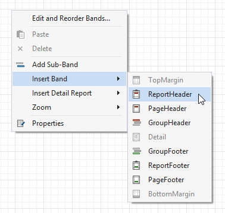
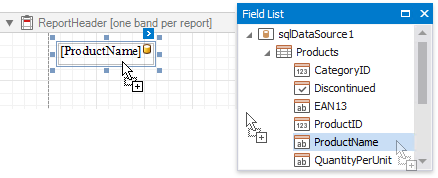
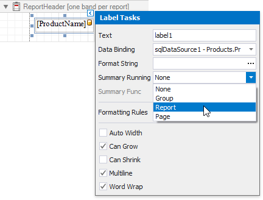
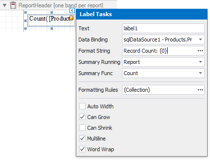
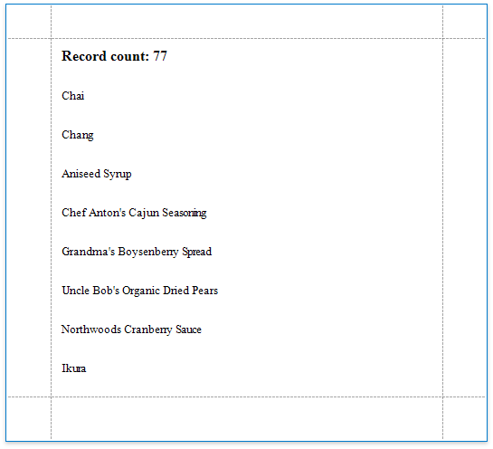

# Count the Number of Records in a Report or Group

This document describes how to display the number or records in a report or group.

> [!NOTE]
> Use this approach if data bindings **are enabled** in the Report Designer (the Label's smart tag includes the **Data Binding** property).
>
> 
>
> See the [Count the Number of Records in a Report or Group](../shape-data-expression-bindings/count-the-number-of-records-in-a-report-or-group.md) topic in the [Shape Data (Expression Bindings)](../shape-data-expression-bindings.md) section to learn about an alternative approach.

1. Right-click the report's design surface and add a Report Header or Footer to display the record count for the entire report.
	
	
	
	> [!Note]
	> Use a Group Header/Footer for displaying record counts for groups, and a Page Header/Footer for displaying record counts for pages.

2. Switch to the [Field List](../../report-designer-tools/ui-panels/field-list.md) and drop the corresponding data table field onto the created band to create a data-bound label.
	
	

3. Click the label's smart tag and invoke its **Summary Running** drop-down list. Select **Report** to count the records throughout the entire report, or select **Group** or **Page** to reset the record count for every group or page.
	
	

4. Set the **Summary Func** property to **Count** and use the **Format String** property to format the summary's value.
	
	

You can switch to [Print Preview](../../preview-print-and-export-reports.md) to see the resulting report.

