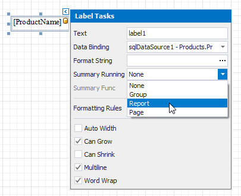
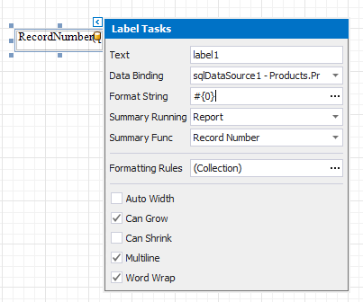

# Display Row Numbers in a Report, Group or Page

This document describes how to show the current row number for each data source value displayed in a report.

> [!NOTE]
> Use this approach if data bindings **are enabled** in the Report Designer (the Label's smart tag includes the **Data Binding** property).
>
> 
>
> See the [Display Row Numbers in a Report, Group or Page](../shape-data-expression-bindings/display-row-numbers-in-a-report-group-or-page.md) topic in the [Shape Data (Expression Bindings)](../shape-data-expression-bindings.md) section to learn about an alternative approach.

A label can display row numbers after [binding your report to data](../../bind-to-data.md) and specifying a bound data field.

1. Click the label's smart tag and invoke its **Summary Running** drop-down list. Select **Report** to increment the row numbers throughout the entire report, or select **Group** or **Page** to reset the row numbers for every group or page.
	
	

2. Set the **Summary Func** property to **Record Number** and use the **Format String** property to format the summary's value.
	
	

You can switch to [Print Preview](../../preview-print-and-export-reports.md) to see the record numbers displayed for the specified range.

