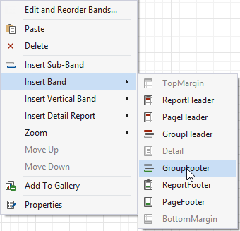
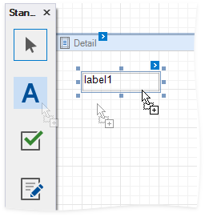
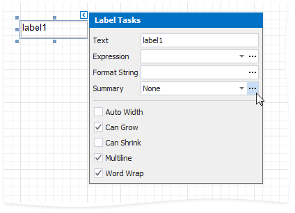

# Calculate a Summary

This document shows how to use a report control's Expression property to calculate a group summary, as shown in the image below:

> [!NOTE]
> Use this approach if expressions **are enabled** in the Report Designer (the Label's smart tag includes the **Expression** property).
>
> 

> See the [Calculate a Summary](../shape-data-data-bindings/calculate-a-summary.md) topic in the [Shape Data (Data Bindings)](../shape-data-data-bindings.md) section to learn about an alternative approach.

Follow the steps below to calculate a summary:

1. Create a report [bound](../../../../../articles/report-designer/report-designer-for-winforms/bind-to-data.md) to a data source.

1. Use the [Group and Sort Panel](../../../../../articles/report-designer/report-designer-for-winforms/report-designer-tools/ui-panels/group-and-sort-panel.md) to [group report data](../../../../../articles/report-designer/report-designer-for-winforms/shape-report-data/group-and-sort-data/group-data.md) by the key data field and construct a layout like the following:

	

1. Right-click the report's **Detail** band and select **Insert Band** / **Group Footer** from the context menu.

	

1. Drop a **Label** control onto the **Group Footer** band.

	

1. Click the label's smart tag, then click the **Summary** field's ellipsis button to open the **Summary Editor** form.

	

1. In the **Summary Editor** form, use the following options:

	* **Summary running** - specifies summary calculation range (the entire report, current report group, or current document page).
	* **Summary function** - specifies a summary function.
	* **Argument expression** - specifies a data field or a complex expression.

	

	> [!TIP]
	> See the [Expression Operators, Functions and Constants](../../../../../articles/expression-editor/expression-operators-functions-and-constants.md) topic for a complete list of supported summary functions.
1. You can use the **Format String** property to format the summary value:
	
	

Switch to Print Preview mode to see the result:

