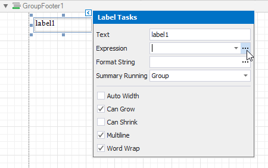
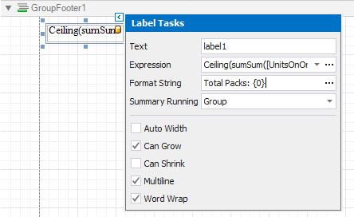

# Calculate an Advanced Summary

This document describes how to calculate an advanced summary for report groups using a built-in summary function and arithmetical or logical functions.

> [!Warning]
> Use the approach below if expression bindings **are enabled** in the Report Designer (the [Property Grid](../../report-designer-tools/ui-panels/property-grid.md) provides the **Expressions**  tab ).
>
> See [Calculate a Custom Summary](../shape-data-data-bindings/calculate-a-custom-summary.md) if expression bindings **are not enabled** in the Report Designer (the [Property Grid](../../report-designer-tools/ui-panels/property-grid.md) does not provide the **Expressions**  tab).

1. [Create a new report](../../add-new-reports.md) or open an existing one and [bind it to a data source](../../bind-to-data.md).

2. Switch to the [Group and Sort](../../report-designer-tools/ui-panels/group-and-sort-panel.md) panel and group the report's data by the required field. Display the footer for the created group.

    

3. Drop a [Label](../../use-report-elements/use-basic-report-controls/label.md) onto the group footer to display the summary result. Click the label's smart tag and set its **Summary Running** property to **Group**.

    

4. Click the ellipsis button for the label's **Expression** property.

    

5. This invokes the **Summary Expression Editor** where you can specify a custom expression with the required summary functions and other logical or arithmetical functions. For example:

    

	> [!TIP]
	> See the [Expression Constants, Operators, and Functions](../../use-expressions/expression-syntax.md) topic for a complete list of supported summary functions.

6. You can use the **Format String** property to format the summary's value.
	
	

Switch to [Print Preview](../../preview-print-and-export-reports.md) to see the result.

