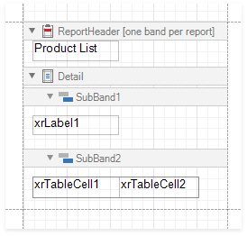
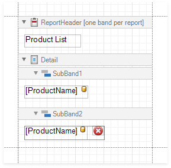
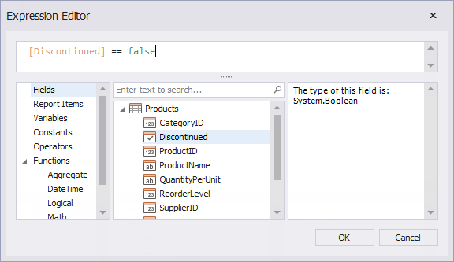
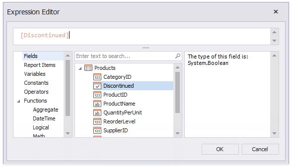

# Conditionally Change a Band's Visibility

This topic describes how to change report band visibility.

Set a band's **Visible** property to an expression to conditionally change the band's visibility based on a field's value or a parameter.

The report created in this tutorial contains two Detail **sub-bands** with different report controls. These sub-bands are used to display discontinued and current products.   

Follow the steps below to see how to change the sub-bands' visibility based on the **Product**'s **Discontinued** field value.

1. Bind your report to the Products table from the Northwind database.

2. Add two **Sub-bands** to the Detail band, and drag the **XRLabel** from the **Toolbox** to the first sub-band and **XRTable** to the second sub-band.

	

	Bind **Label1** and **TableCell1** to the **ProductName** field. Add an **XRPictureBox** control to the **TableCell2** and specify its **ImageSource** property. This picture will serve as an indication of discontinued products.
	
	

3. Select **SubBand1** and switch to the Visual Studio property grid. Switch to its Expressions section and click the **Visible** property's ellipsis button.

	In the invoked Expression Editor, specify the **Iif(![Discontinued], true, false)** expression.

	This expression sets the **Visible** property to *True* or *False* based on the **Discontinued** data field's value. 

	

	Do the same with **SubBand2**. But use the **[Discontinued]** expression.

	

As a result, Print Preview displays how changes to band visibility influence the Product List. The **SubBand1** is used to display products that have the **Discontinued** field set to false, and the **SubBand2** is used to display discontinued products.

