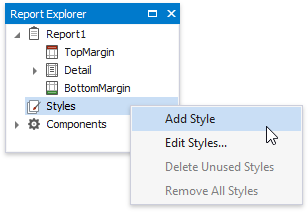
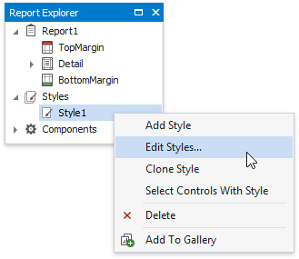
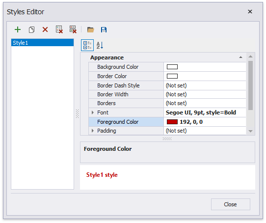
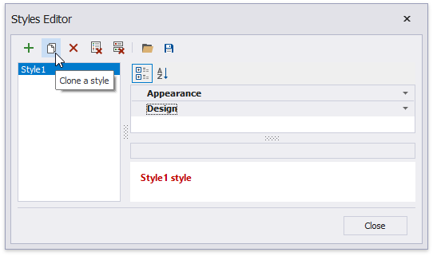
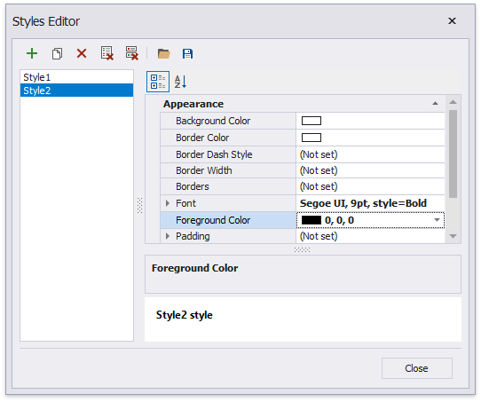
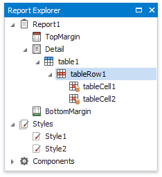
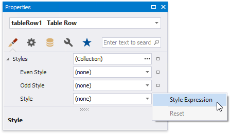
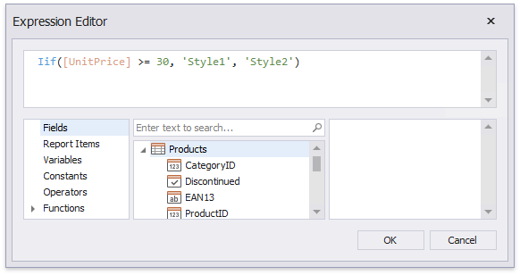
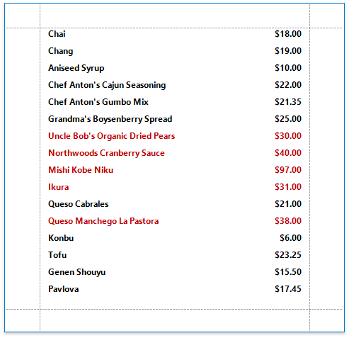

# Conditionally Change a Control's Appearance

This document describes how to change a report control's appearance based on a specific condition.

> [!Warning]
> Use the approach below if expression bindings **are enabled** in the Report Designer (the [Property Grid](../../report-designer-tools/ui-panels/property-grid.md) provides the **Expressions**  tab ).
>
> See [Conditionally Change a Control's Appearance](../shape-data-data-bindings/conditionally-change-a-control-appearance.md) if expression bindings **are not enabled** in the Report Designer (the [Property Grid](../../report-designer-tools/ui-panels/property-grid.md) does not provide the **Expressions**  tab).

1. Switch to the [Report Explorer](../../report-designer-tools/ui-panels/report-explorer.md) and right-click the **Styles** category to create a new visual style.
	
	

2. Right-click the created style and select **Edit Styles**.
	
	

3. In the invoked **Styles Editor**, customize the created style's appearance settings.
	
	

4. Create another style by cloning the existing one.
	
	

5. Customize the new style's appearance settings and close the editor.
	
	

6. Back in the Report Explorer, select a report element to which you wish to assign the created styles.
	
	

7. Switch to the **Expressions** section in the [Property Grid](../../report-designer-tools/ui-panels/property-grid.md) and click the ellipsis button for the control's **Style Name** property.
	
	

8. In the invoked **Expression Editor**, specify the required condition for switching between the created styles.
	
	

Switch to [Print Preview](../../preview-print-and-export-reports.md) to view the resulting report.

