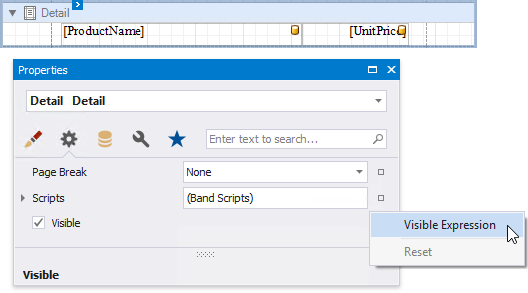

# Conditionally Filter Report Data

This document describes how to filter a report's data based on a specific condition.

> [!Warning]
> Use the approach below if expression bindings **are enabled** in the Report Designer (the [Property Grid](../../report-designer-tools/ui-panels/property-grid.md) provides the **Expressions**  tab ).
>
> See [Conditionally Filter Report Data](../shape-data-data-bindings/conditionally-filter-report-data.md) if expression bindings **are not enabled** in the Report Designer (the [Property Grid](../../report-designer-tools/ui-panels/property-grid.md) does not provide the **Expressions**  tab).

1. Switch to the [Field List](../../report-designer-tools/ui-panels/field-list.md), right-click the **Parameters** section and add a new report parameter.
	
	

2. Specify the parameter's description in Print Preview and set its type to **Number (Integer)**.
	
	

3. Select the report's detail band and switch it to the [Property Grid](../../report-designer-tools/ui-panels/property-grid.md). Navigate to its **Expressions** tab and click the **Visible** property's ellipsis button.
	
	

4. In the invoked **Expression Editor**, specify the required visibility condition. For example:
	
	
	
	The expression above makes the **Visible** property return **True** or **False** depending on whether the field value is below the specified parameter value.

Switch to [Print Preview](../../preview-print-and-export-reports.md) to see the result. 

