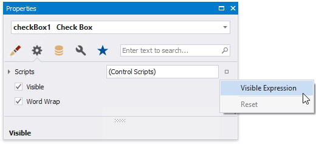

# Conditionally Suppress Controls

This document describes how to display or hide a report control in a published document based on a specified logical condition.

> [!Warning]
> Use the approach below if expression bindings **are enabled** in the Report Designer (the [Property Grid](../../report-designer-tools/ui-panels/property-grid.md) provides the **PropertyName Expression** item in the property marker's context menu).
>
> See [Conditionally Suppress Controls](../shape-data-data-bindings/conditionally-supress-controls.md) if expression bindings **are not enabled** in the Report Designer.

1. [Create a new report](../../add-new-reports.md) or open an existing one and prepare the report layout.

    

2. Select the required control and switch to the [Property Grid](../../report-designer-tools/ui-panels/property-grid.md). Open the **Behavior** tab, click the **Visible** property's marker and select **Visible Expression** in the context menu.

    

3. In the invoked **Expression Editor**, specify the required [expression](../../use-expressions.md).
	
	
	
	Use the **Iif** function to define the required condition. For example:
	
	**Iif([Discontinued] == False, False, [Discontinued])**
	
	This expression means that if the data field's value is **False**, the control's **Visible** property is disabled.

When switching to [Print Preview](../../preview-print-and-export-reports.md), you can view the report control's visibility changes according to the assigned condition.

> [!Note]
> See [Hide Table Cells](../../use-report-elements/use-tables/hide-table-cells.md) to learn how to conditionally suppress table cells and define the mode for processing them.