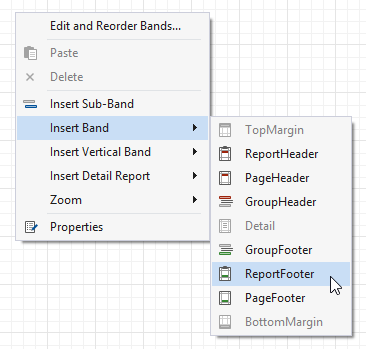

# Count the Number of Groups in a Report

This document describes how to count the number of groups in a report.

> [!Warning]
> Use the approach below if expression bindings **are enabled** in the Report Designer (the [Property Grid](../../report-designer-tools/ui-panels/property-grid.md) provides the **Expressions**  tab ).
>
> See [Count the Number of Groups in a Report](../shape-data-data-bindings/count-the-number-of-groups-in-a-report.md) if expression bindings **are not enabled** in the Report Designer (the [Property Grid](../../report-designer-tools/ui-panels/property-grid.md) does not provide the **Expressions**  tab).

1. Switch to the [Group and Sort](../../report-designer-tools/ui-panels/group-and-sort-panel.md) panel and create a new group. Enable the **Show Header** option to display the Group Header in the report.
	
	

2. Switch to the [Field List](../../report-designer-tools/ui-panels/field-list.md) and drop the group field onto the created Group Header.
	
	

3. Right-click the report's surface and add a Report Footer to the report.
	
	

4. Drop a label onto the Report Footer and invoke its smart tag. Set its **Summary Running** property to **Report**.
	
	

5. Click the ellipsis button for the label's **Expression** property.
	
	

6. In the invoked **Summary Expression Editor**, select the **sumDCount** summary function in the **Functions** | **Summary** section.
	
	

7. Use the **Format String** property to format the summary's value.
	
	

You can see the group count in the report footer when switching to [Print Preview](../../preview-print-and-export-reports.md).

