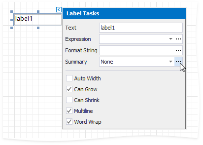
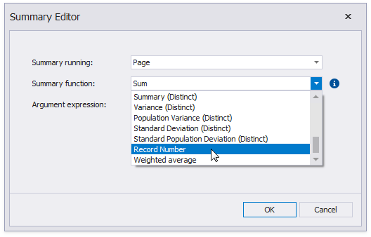
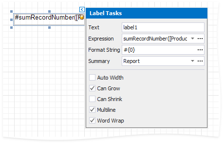

# Display Row Numbers in a Report, Group or Page

This document describes how to show the current row number for each data source value displayed in a report.

> [!NOTE]
> Use this approach if expressions **are enabled** in the Report Designer (the Label's smart tag includes the **Expression** property).
>
> 

> See the [Display Row Numbers in a Report, Group or Page](../shape-data-data-bindings/display-row-numbers-in-a-report-group-or-page.md) topic in the [Shape Data (Data Bindings)](../shape-data-data-bindings.md) section to learn about an alternative approach.

A label can display row numbers after [binding your report to data](../../bind-to-data.md) and specifying a bound data field in the Label's **Expression** property.

1. Click the label's smart tag. In the invoked **Label Tasks** window, click the **Summary** property's ellipsis button.
	
	

2. In the Summary Editor window:

	* Set the **Summary running** property. Select **Report** to increment the row numbers throughout the entire report, or select **Group** or **Page** to reset the row numbers for every group or page.
	* Set the **Summary function** property to **Record Number**.
	
	

3. Back in the **Label Tasks** window, you can use the **FormatString** property to format the resulting value:
	
	

You can switch to [Print Preview](../../preview-print-and-export-reports.md) to see the record numbers displayed for the specified range.

