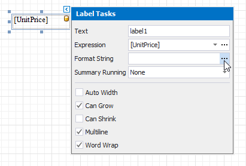
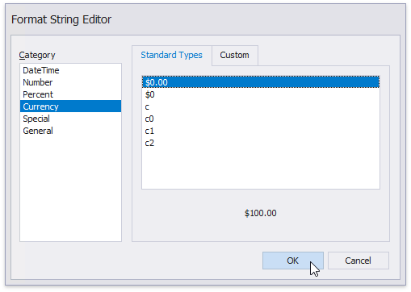
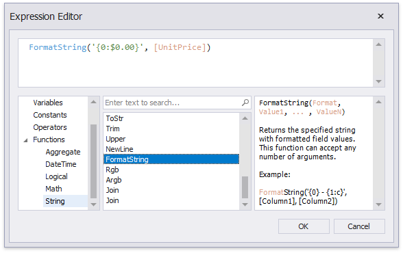
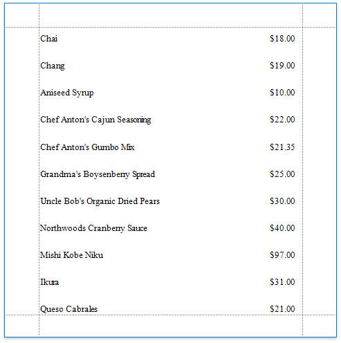

# Format Data

This document demonstrates how to specify value formatting for report elements (for instance, format numeric values as a currency or apply a percent format).

> [!NOTE]
> Use this approach if expressions **are enabled** in the Report Designer (the Label's smart tag includes the **Expression** property).
>
> 
>
> See the [Format Data](../shape-data-data-bindings/format-data.md) topic in the [Shape Data (Data Bindings)](../shape-data-data-bindings.md) section to learn about an alternative approach.

After you [bound your report to data](../../bind-to-data.md) and specified a bound data field in a report control's **Expression** property, you can format data values in a report.

1. Invoke the control's smart tag and click the **Format String** property's ellipsis button.
	
	

2. This invokes the **Format String Editor** where you can specify the required format.
	
	

Alternatively, you can use the **FormatString** function within the expression you specified for the report control.

When switching to [Print Preview](../../preview-print-and-export-reports.md), you can view the report control displaying values with the specified format.

You can use the control's **Xlsx Format String** property to assign a native Excel format that is used for exporting reports to [XLSX](../../../../print-preview/print-preview-for-winforms/exporting/xlsx-specific-export-options.md).