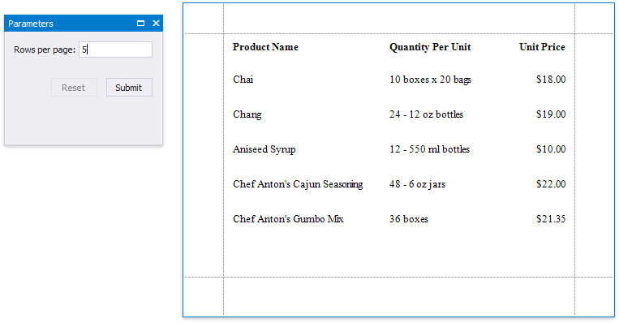

# Limit the Number of Records per Page

This document describes how to specify the number of data source records displayed on report pages.

> [!NOTE]
> Use this approach if expressions **are enabled** in the Report Designer (the Label's smart tag includes the **Expression** property).
>
> 

> See the [Limit the Number of Records per Page](../shape-data-data-bindings/limit-the-number-of-records-per-page.md) topic in the [Shape Data (Data Bindings)](../shape-data-data-bindings.md) section to learn about an alternative approach.

After you [bound your report to data](../../bind-to-data.md) and provided content to the report's [Detail band](../../introduction-to-banded-reports.md), you can limit the number of records each report page displays. This example demonstrates how to pass the required record count as a parameter value.

1. Switch to the [Field List](../../report-designer-tools/ui-panels/field-list.md), right-click the **Parameters** section and add a new report parameter.
	
	

2. Specify the parameter's description displayed in Print Preview and set its type to **Number (Integer)**.
	
	

3. Drop a [Page Break](../../use-report-elements/use-basic-report-controls/page-break.md) control onto the report's detail band and switch to the [Property Grid](../../report-designer-tools/ui-panels/property-grid.md). Open the **Behavior** tab, click the **Visible** property's marker and select **Visible Expression** in the context menu.
	
	

4. In the invoked **Expression Editor**, specify the required [expression](../../use-expressions.md).
	
	
	
	For example:
	
	**([DataSource.CurrentRowIndex] % ?parameter1 == 0) And ([DataSource.CurrentRowIndex] !=0)**

When switching to [Print Preview](../../preview-print-and-export-reports.md), you can specify how many rows each report page should display by entering the corresponding parameter value:

