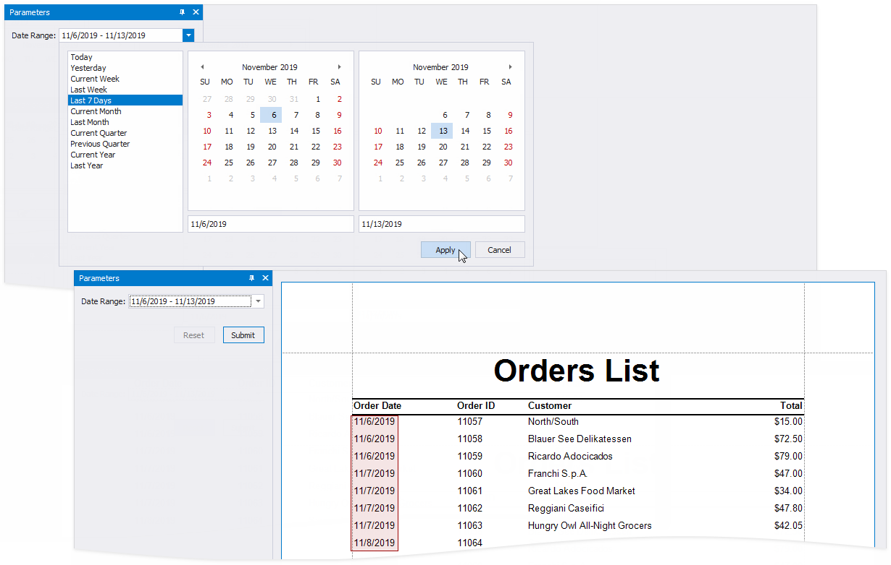
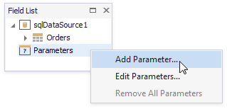
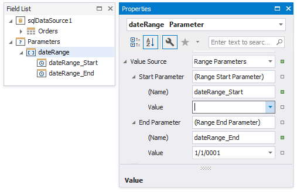
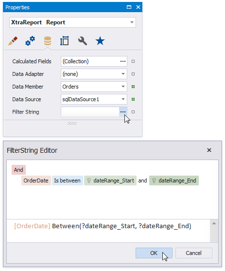
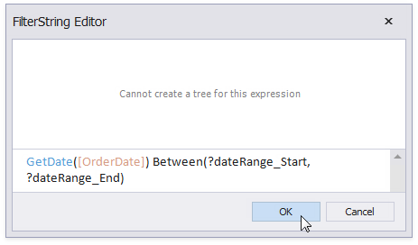

# Date Range Parameters

This document describes how to create a date range parameter and filter report data by the specified dates.

Perform the steps below to add a date range parameter to a report.

1. Switch to the [Field List](../../report-designer-tools/ui-panels/field-list.md) and right-click **Parameters**. Select **Add Parameter** from the context menu.

    

1. Specify the options below in the invoked **Add New Parameter** dialog and click **OK**.

    - **Name** - the parameter's name;
    - **Description** - the parameter's description displayed in Print Preview's **Parameters** panel;
    - **Type** - the parameter's data type. Set it to **Date** to create a date range;
    - **Range Value** - enable this option to create a date range.

    

1. The _dateRange_ parameter appears in the **Field List** and includes the  _dateRange_Start_ and _dateRange_End_ parameters. Select the _dateRange_ parameter and switch to the **Property Grid** to specify the parameters' default values.

    

    The **Value** property allows you to specify a static value. To specify a dynamic value, click the **Value** property's marker, select **Value Expression** and specify an expression in the invoked editor.

    

1. Use the start and end parameter names in the report's filter string to [filter data](../filter-data/filter-data-at-the-report-level.md) by the specified date range. Select the report, click the **Filter String** property's ellipsis button in the **Property Grid** and construct a filter string in the invoked **FilterString Editor**.

    

    > [!NOTE]
    > The start and end parameter values store the selected day's midnight time. For instance, if you choose _10/15/2019_, the value is _10/15/2019 12:00:00 AM_. If your date fields include non-midnight time, records for the end date _10/15/2019_ are excluded from a report. Use the **GetDate()** function in the **FilterString Editor** to include data for the 10/15/2019 date.  
    > 

When you switch to Print Preview, the **Parameters** panel displays the date range parameter. After you submit a start and end date, a report document is displayed with filtered data.

