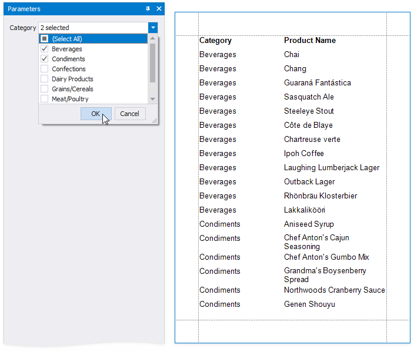
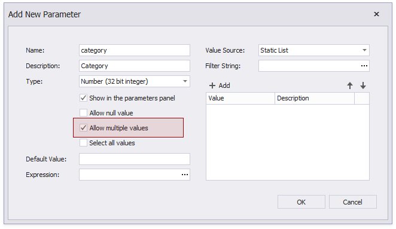
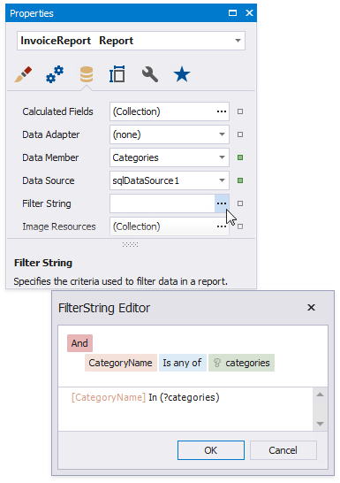
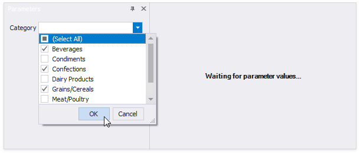
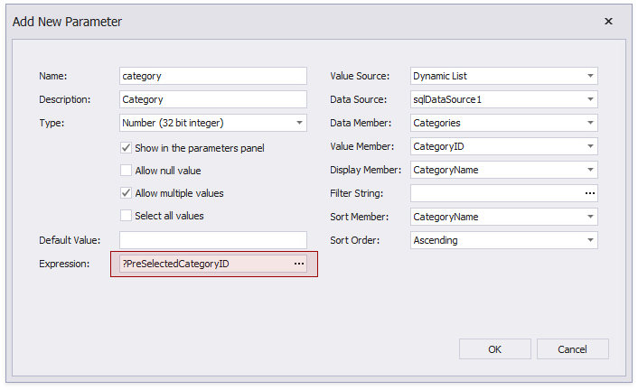
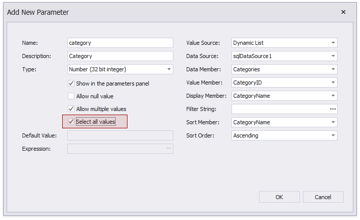
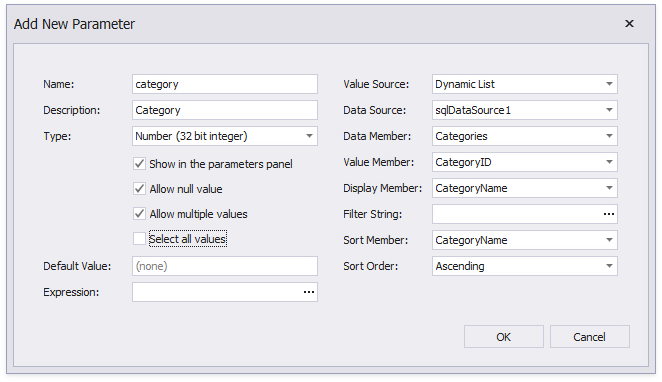
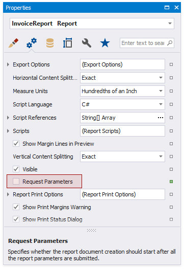
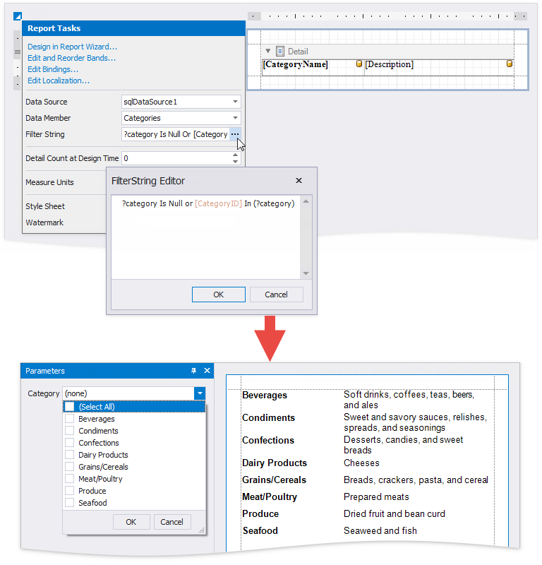

# Multi-Value Report Parameters

This document describes how to create a multi-value parameter and [filter report data](../filter-data.md) by the specified parameter values.



## Create a Multi-Value Parameter

1. [Create a report parameter](create-a-report-parameter.md) and enable the **Allow multiple values** option.

    

1. Specify a list of predefined values for the parameter. See the following topics for more information:

    * [Report Parameters with Predefined Static Values](report-parameters-with-predefined-static-values.md) - to directly specify the list of values.
    * [Report Parameters with Predefined Dynamic Values](report-parameters-with-predefined-dynamic-values.md) - to specify the storage that contains the list of values.

## Filter a Report by a Multi-Value Parameter

Use the **Is any of** operator in the report’s [filter string](../filter-data/filter-data-at-the-report-level.md):



## Pre-Select Parameter Values

Use one of the following methods to pre-select multiple parameter values when a report is first rendered.



* Assign an array of values to the **Default Value** property.  

    

* Set the **Expression** property to an expression that evaluates to an array of values. You can use data source fields and other parameters in expressions.

    

* Enable the **Select all values** property to populate the parameter value with all items from its data source (static or dynamic).

    

> [!TIP]
> Disable the report's **Request Parameters** property to avoid the **Waiting for parameter values** message in **Preview** and display the report with pre-selected parameter values.

## Optional Multi-Value Parameter

You can leave the parameter unspecified and display all report data, or choose parameter values to filter the report.


Do the following to make a multi-value parameter optional.

1. Configure the parameter:

    

    | Property | Value |
    | --- | --- |
    | **Allow null value** | Checked |
    | **Default Value** | Not specified |
    | **Expression** | Not specified |
    | **Select all values** | Unchecked |

1. Disable the report's **Request Parameters** property.

    

1. Use the following report filter string:

    ```
    ?category Is Null or [CategoryID] In (?category)
    ```



> [!TIP]
> You can also use the filter string shown above to [filter report data at the data source level](../filter-data/filter-data-at-the-data-source-level.md).