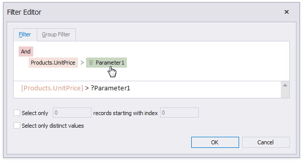
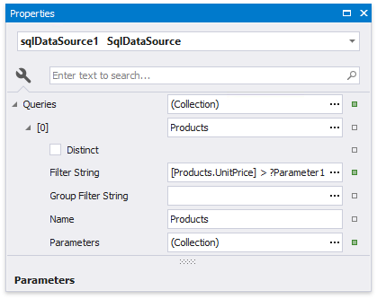
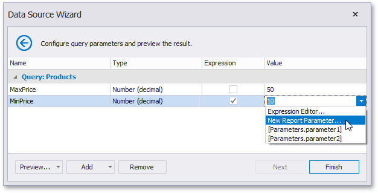
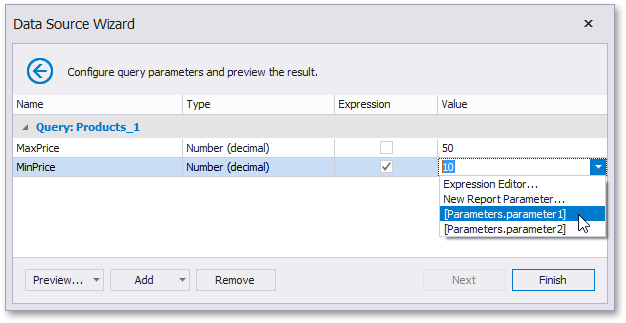
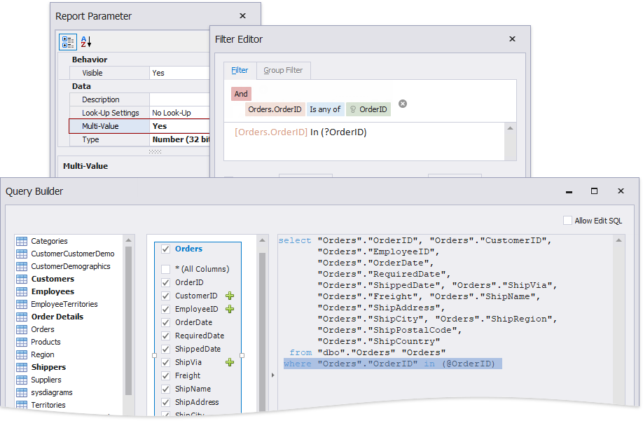
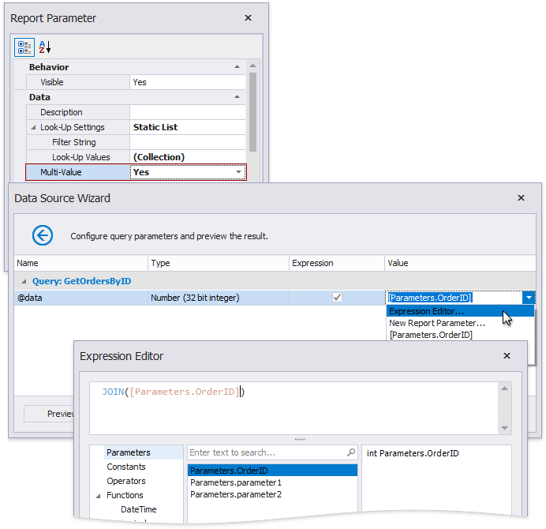

# Use Query Parameters

This document provides general information on query parameters and describes common ways of utilizing parametrized SQL queries to filter data at the data source level.

## Query Parameters Overview
A query parameter holds an external value that is inserted into an SQL statement before query execution. This value can be either static or dynamically generated by an associated expression.

The query parameter value is inserted into the resulting SQL query string in the "\@QueryParameterName" placeholder's position.

Query parameters are used in the following scenarios:

* When filtering report data at the data source level using the [Query Builder](../../report-designer-tools/query-builder.md).
	
	The Query Builder helps you construct SQL queries when creating a new data-bound report or [binding an existing report to an SQL data source](../../bind-to-data/bind-a-report-to-a-database.md),
	
	
	
	... or when adding queries to an existing SQL data source or editing existing queries.
	
	
	
	You can filter the constructed queries using query parameters. Press the **Edit Parameters...** button to invoke the **Query Parameters** dialog.
	
	
	
	Press the **Filter...** button to invoke the Filter Editor and filter data using the created query parameters.
	
	
	
	The criteria based on the specified query parameters are added as an SQL statement's WHERE part.
	
* When [binding a report to a stored procedure](../../bind-to-data/bind-a-report-to-a-stored-procedure.md) provided by an SQL data source.
	
	The Report Wizard, as well as the Data Source Wizard, include the **Create a query or select a stored procedure** page. If you select a stored procedure, the wizard creates a query parameter for each procedure parameter and allows you to configure the query parameters in the next **Configure query parameters and preview the result** page.
	
	

You can access query parameters using the **Parameters** property of the query the report's **SqlDataSource** component exposes. These parameters include the ones you created within the Query Builder or that were generated for the data source's stored procedure. You can also access the query’s filter string using the **Filter String** property. This filter string includes the filter that you specified in the Query Builder.

You can add new query parameters in the Query Parameters dialog and modify the filter within the Filter Editor.

## Configure Query Parameters
The following properties are available for each query parameter:

* **Name** - specifies the parameter's name.
* **Type** - specifies the parameter value's data type.
* **Expression** - determines whether the actual parameter value is static or generated dynamically.
* **Value** - determines the query parameter's actual value. If the **Expression** option is enabled, the actual parameter value is produced dynamically by calculating an associated expression. This is useful when you map the query parameter value to the [report parameter](parameters-overview.md) value. Refer to the next document section for more information.

## Provide the Query Parameter Value
Below, you can see how a value is specified for a query parameter within the Data Source Wizard's page. You can also specify query parameter values in the Report Wizard or the Query Parameters dialog in the same way.

* **Specifying a static value**
	
	Choose a query parameter's value type and set a static value to the **Value** property according to the selected type.
	
	

* **Providing a dynamic value**
	
	Activate the **Expression** checkbox for a parameter.
	
	The following three options are used to dynamically calculate the parameter's actual value:
	
	* Create a complex expression by expanding the **Value** property's drop-down list and selecting **Expression Editor**.
		
		
		
		Construct an expression in the invoked **Expression Editor**.
		
		

	* Map a new report parameter to a query parameter by expanding the **Value** property's drop-down list and selecting **New Report Parameter**.
		
		
		
		Specify report parameter settings in the invoked **Report Parameter** dialog. Remember to specify the report parameter type according to the type of the corresponding query parameter. Click **OK** to exit the dialog.
		
		

	* Map a report parameter that already exists in a report to a query parameter by expanding the **Value** property's drop-down list and selecting the parameter you want to use. An appropriate expression string is generated automatically.
		
		

## Pass a Multi-Value Parameter Value to a Query
You can map [multi-value parameters](create-multi-value-and-cascading-parameters.md) to query parameters. For instance, the following query selects the orders whose IDs can be found within the values the _\@OrderID_ query parameter provides.

## Pass a Multi-Value Report Parameter Value to a Stored Procedure
You cannot pass a [multi-value parameter](create-multi-value-and-cascading-parameters.md) value to a stored procedure directly. Use one of the following expression functions:

* Use the [Join() expression function](../../use-expressions/expression-syntax.md) to convert the array of parameter values to a string if you use MS SQL Server, MySQL or Oracle database systems.

	

* Use the [CreateTable() expression function](../../use-expressions/expression-syntax.md) to prepare a table using values of several multi-value parameters.

	