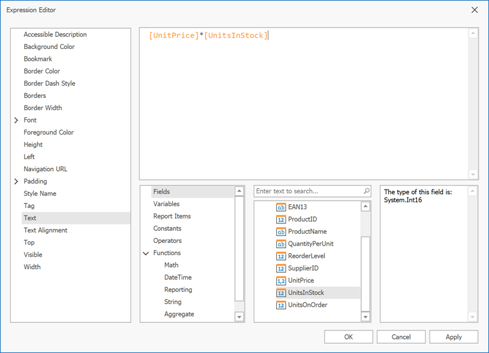
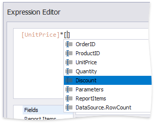
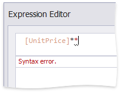
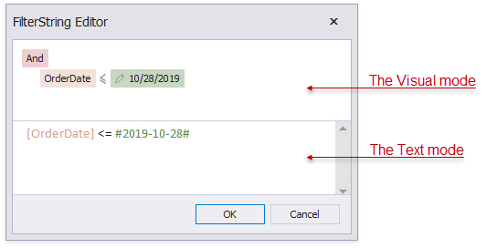
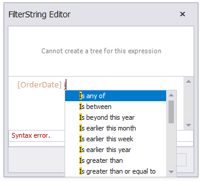

# Use Expressions

Use expressions to [retrieve and format data](use-report-elements\bind-controls-to-data.md), [create calculated fields](shape-report-data\use-calculated-fields.md) and [calculate summaries](shape-report-data\calculate-summaries\calculate-a-summary.md), [conditionally shape data and change a report control's appearance](shape-report-data\specify-conditions-for-report-elements.md).

## Expression Syntax

An expression is a string that is parsed and processed to evaluate a value. Expressions consist of field names, constants, operators, and functions. Field names are wrapped in square brackets.

_"[Quantity] * [UnitPrice] * (1 - [BonusAmount])"_

_"[FirstName] + ' ' + [LastName]"_

_"[Country] == 'USA'"_

_"[OrderDate] > #8/16/1994# AND [Quantity] > 20"_

You can use [operators, functions, and constants](use-expressions\expression-syntax.md) in your expressions.

See the [Data Binding Modes](use-expressions/data-binding-modes.md) topic for details on the available binding modes.

## Expression Editor

The Report Designer's Expression Editor provides functions, operators, data source fields, report elements, constants, and variables to construct expressions.

The Expression Editor highlights an expression's syntax and supports intelligent code completion (it suggests functions and available data elements as you type).

The Expression Editor displays all the errors it finds in the specified expression.

## FilterString Editor

The Report Designer's FilterString Editor allows you to specify filter criteria for a report, [Cross Tab](use-report-elements/use-cross-tabs.md), or [Chart](use-report-elements/use-charts-and-pivot-grids.md)'s series.

The FilterString Editor provides a visual interface where you can use an unlimited number of conditions and combine them with logical operators to create filter criteria. You can also switch to the Text mode and type a filter string.

The FilterString Editor highlights an expression's syntax and supports intelligent code completion (it suggests functions and available data elements as you type).

