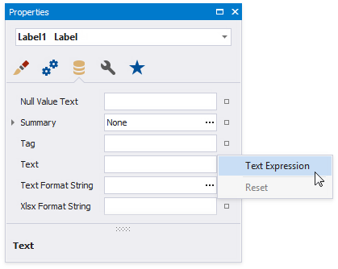

# Data Binding Modes

The Report Designer works in one of the following data binding modes:

* **Expressions** is the default binding mode.

    This mode enables you to specify complex [expressions](../use-expressions.md) that include two or more data fields, [report parameters](../shape-report-data/use-report-parameters.md), or [functions](expression-syntax.md). You can also use expressions to [calculate summaries](../shape-report-data/calculate-summaries/calculate-a-summary.md) of any complexity or [conditionally shape your data](../shape-report-data/specify-conditions-for-report-elements.md).

    Click a property's marker to see whether the invoked context menu has the **PropertyName Expression** item that invokes the **Expression Editor**.

    

    The **Expression Editor** allows you to use functions, access report bands and controls, and reference data source values in the constructed expression.

    

* **Expressions Advanced** is the advanced Expression mode.

    This mode enables you to specify an expression that is evaluated within a control's specific event.

	

    The **Expression Editor** allows you to use event argument values in the constructed expressions. Event arguments are available in the [Variables](expression-syntax.md) section.

    

    In the **BeforePrint** event, you can use data fields from all queries in the data source.

    

    In the **PrintOnPage** event, data source fields are not available because data was fetched when this event occurs. You can use the event arguments that are available in the [Variables](expression-syntax.md) section.

    
