# Add Controls to a Report

## Add Report Controls
To display a data field's value in your report, drag the corresponding item from the [Field List](../../report-designer-tools/ui-panels/field-list.md) and drop it onto the report's detail band. This creates a new report control bound to the corresponding field.

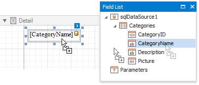

You can also use the [Toolbox](../../report-designer-tools/toolbox.md) to add other controls to your report and display content such as text, images, charts, barcodes, and so on.

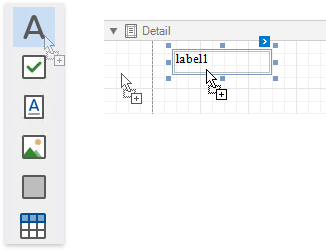

This document describes how to add the most commonly used controls to a report. See [Use Report Controls](../../use-report-controls.md) for a complete list of available controls.

## Display Text
Use the following controls to display text in a report:

* [Label](../use-basic-report-controls/label.md)
	
	Displays plain text in a report. 

	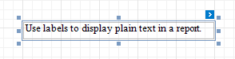
	

* [Rich Text](../use-basic-report-controls/rich-text.md)
	
	Displays rich text in a report. You can apply different font settings to the control's content and load content from an external file.

	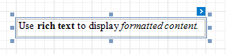
	

* [Table](../use-tables.md)
	
	Contains any number of cells arranged in one or more rows.
	Each table cell can display plain text or contain other controls.

	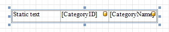
	
* [Character Comb](../use-basic-report-controls/character-comb.md)
	
	Displays each character in a separate cell and can be used to create printed forms.

	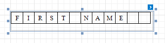
	

Double-click any of these controls to invoke an in-place editor where you can enter and format text.

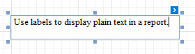

Press CTRL+Enter to submit changes and close this mode.

You can use the corresponding toolbar elements to access the selected control's font and alignment settings.

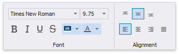

Labels and other text-oriented controls can display the following content:

* **Static content**
	
	A control's content does not change once it is specified in a published document.

	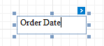

* **Dynamic content**
	
	A connected data source supplies this content. In a published document, it changes according to the printed data source record.

	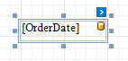
	
	You can use a control's smart tag to format dynamic content.

	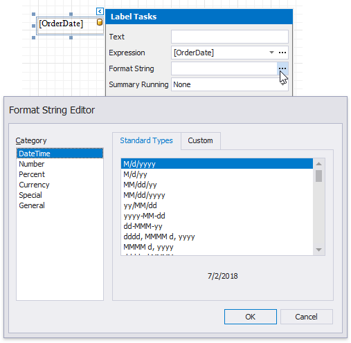
	

* **Mixed content**
	
	You can combine labels' and other text-oriented controls' static and dynamic content within the same control.
	
	In the in-place editor, enclose data source fields in square brackets to embed these fields into the control's text. 

	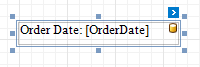
	
	You can select a field in the in-place editor and use the **Format String** property in the control's smart tag to format this field's value.

	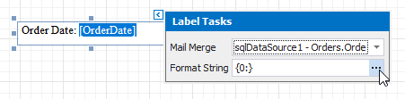

## Display Page Information
Use the [Page Info](../use-basic-report-controls/page-info.md) control to display information about document pages, such as the current page number and/or total number of pages.

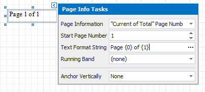

You can also use this control to add information about a report's author and the document's creation date.

See the following tutorials for detailed instructions:

* [Add Page Numbers](../../add-navigation/add-page-numbers.md)
* [Display the User Name in a Report](../../add-extra-information/display-the-user-name-in-a-report.md)
* [Display the Current Date and Time in a Report](../../add-extra-information/display-the-current-date-and-time-in-a-report.md)

## Display Check Boxes, Images and Bar Codes
Drop a Boolean data field from the Field List onto a report to create a [Check Box](../use-basic-report-controls/check-box.md) control bound to that field.

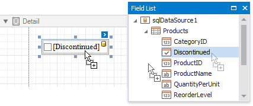

Check boxes can display different states depending on the underlying data values.

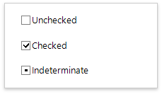

Use the [Picture Box](../use-basic-report-controls/picture-box.md) control to display images in a report. You can load an image from an external file or bind this control to a binary data source field.

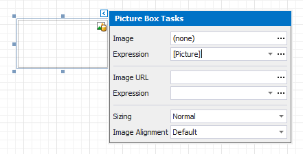

To display bar codes, use the [Bar Code](../use-bar-codes.md) control.

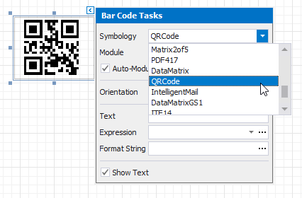

## Drawing Lines and Shapes
Use the [Shape](../draw-lines-and-shapes/draw-shapes.md) control to draw simple graphics in a report (circles, crosses or arrows).

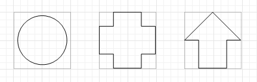

The [Line](../draw-lines-and-shapes/draw-lines.md) control enables you to draw straight or slanted lines in a single band.

The [Cross-Band Line and Box](../draw-lines-and-shapes/draw-cross-band-lines-and-boxes.md) controls enable you to draw lines and boxes spanning multiple report bands.
