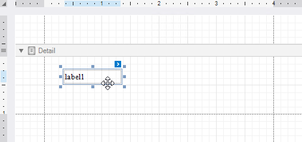
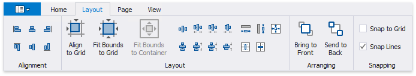
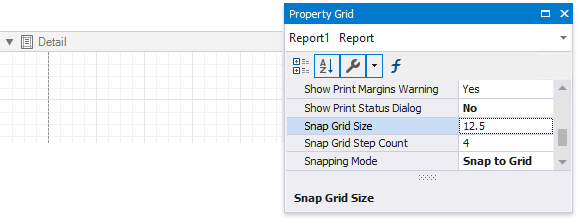
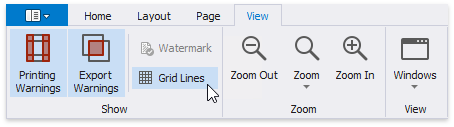
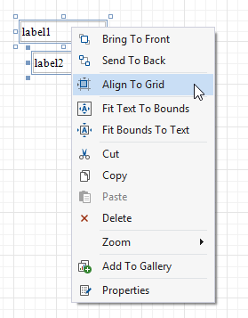
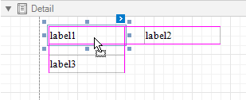
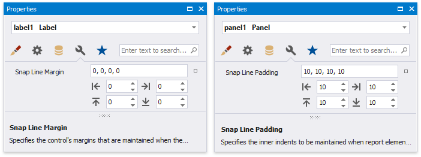

# Arrange Report Controls

The following tools allow you to control report elements' size, location, alignment and maintain the distance between them:

* **Rulers**
	
	The Report Designer provides horizontal and vertical rulers to help you determine report elements' size and location.

	
	
* **Layout Toolbar**
	
	The **Layout** toolbar tab enables you to align report controls to each other, change the report element's size, change the stacked elements' order, and so on.

	

* **Snapping**
	
	Use the **Snapping** toolbar group or a report's **Snapping Mode** property to enable automatic report control snapping to a grid and/or snap lines.
	
	* **Snap Grid**
		
		The design surface displays a visual grid that allows you to determine elements' size and location in a report. Use the **Snap Grid Size** and **Snap Grid Step Count** properties to customize the grid's settings.

		
		
		To hide the grid, disable the **Grid Lines** option in the toolbar's **View** tab or set a report's **Draw the Grid** property to **false**.

		
								
		Relocating a report control with the mouse or ARROW keys automatically aligns the control to the nearest grid cell.

		You can use the **Align to Grid** toolbar button or context menu item to align the selected controls to the grid's cells.

		
		
		You can temporarily ignore snapping when you move and resize controls:
		* hold down ALT if you move or resize controls using the mouse;
		* hold down CTRL if you move or resize controls using the keyboard.

	* **Snap Lines**
		
		The Report Designer displays snap lines when you move or resize report controls. These lines appear around the report controls and indicate the distance to other report elements (controls and bands).

		
				
		When you use the ARROW keys to move a report control or press SHIFT+ARROW to resize the control, it is aligned to the nearest report element in that direction based on snap lines.
		
		A report control's **Snap Line Margin** property and a band's or panel's **Snap Line Padding** property allows you to maintain a uniform distance between elements in a report.

		

		To avoid snapping controls, do the following: 
		* hold down ALT if you move or resize controls using the mouse;
		* hold down CTRL if you move or resize controls using the keyboard.
		
