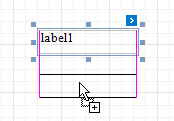
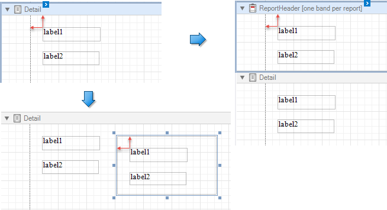
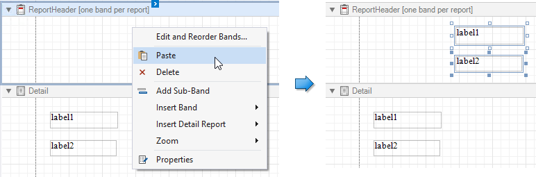

# Copy Report Controls

You can clone an existing report control by selecting it using the mouse, holding the CTRL key and moving the mouse to the required location. A cloned control has the same settings as the initial control.

You can also copy report controls to the clipboard using CTRL + C or the **Copy** command, and then paste these controls to a new container or band. 

* The original control positions are preserved when inserting controls by pressing CTRL + V or using the **Paste** toolbar command. 

    

    The pasted controls are repositioned by an offset of 10 units on both axes if another control already occupies the target position.

* When inserting controls using the **Paste** context menu command, controls are inserted at the mouse position where you invoked the context menu.

    
