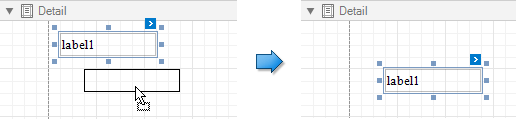
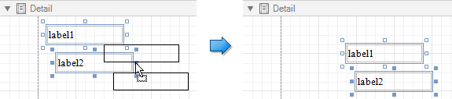
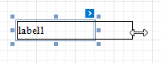
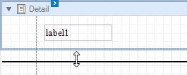

# Move and Resize Report Elements

You can use the mouse or keyboard to move a report control to a new location.

You can also [select multiple controls](select-report-elements-and-access-their-settings.md) and move them in the same way as individual report controls.

To resize a control, select it and then drag a rectangle drawn on its edge or corner.

Drag a band's header strip to resize the band.

You can also press SHIFT+ARROW or CTRL+SHIFT+ARROW to resize a selected element.

See [Arrange Report Controls](arrange-report-controls) for information about tools that help you align report controls to each other and layout edges.
