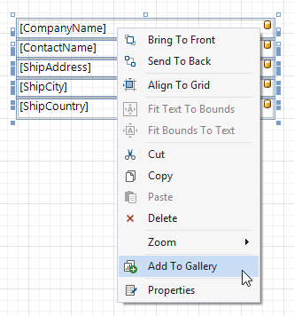
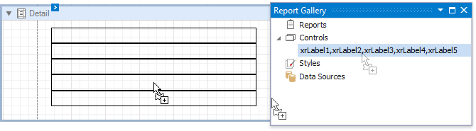

# Reuse Report Controls

You can add selected controls to the [Report Gallery](../../report-designer-tools/ui-panels/report-gallery.md) and reuse them later in other reports. Select one or multiple controls while holding down the SHIFT or CTRL key and choose **Add To Gallery** in the context menu.

To add a selected template to a report, drag it from the Report Gallery onto a report's surface.

A template stores various settings related to its controls, such as binding information and appearance options. All these settings are restored after adding controls to a report.