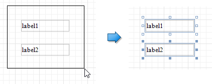
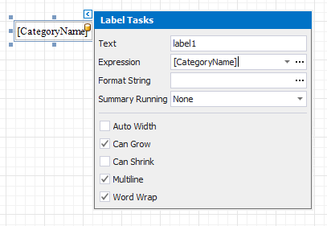
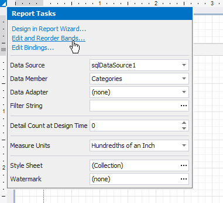
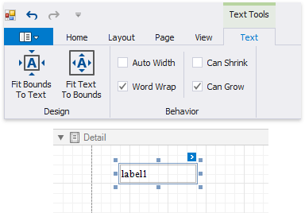
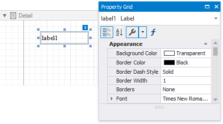

# Select Report Elements and Access Their Settings

You can click a report control or band to select it, and press TAB/SHIFT+TAB to select the next/previous control. 

Do one of the following to select multiple report controls:
* Press and hold the SHIFT or CTRL key and click the controls.
* Click an empty place on a report's surface and draw a rectangle around the controls.
    

Click the gray area around the design surface to select a report.

You can use smart tags to access the most commonly used element properties. Smart tags are available for reports and most report controls and bands.

Smart tags can also contain context links that enable you to perform various actions.

The [Toolbar](../../report-designer-tools/toolbar.md) provides a corresponding contextual tab when you select a report control. This tab allows you to specify settings and perform actions applicable to the selected element's type.

You can use the Property Grid to access the whole set of settings that the selected element supports.

