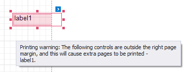

# Validate the Report Layout

Your report layout should meet the following requirements to correctly print and export it:

* **Avoid intersecting controls**
	
	The Report Designer highlights intersecting report controls to warn you that the report layout can be exported incorrectly to HTML, RTF, DOCX, XLS, XLSX, CSV and TXT formats.

	
	
	Disable the **Export Warnings** option in the toolbar to ignore this rule and not highlight intersecting controls. 

	

* **Do not place controls outside page margins**
	
	The Report Designer highlights report controls that do not fit into the printable page area and overlap the right page margin. This warns you that extra pages can appear when document is printed.

	
	
    Disable the **Printing Warnings** option in the toolbar to hide these warnings. 

	
