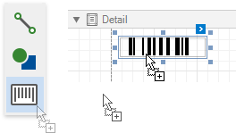
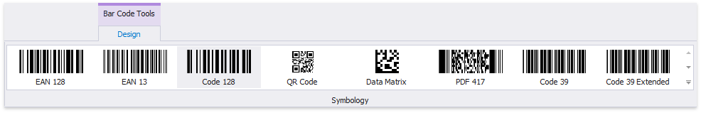
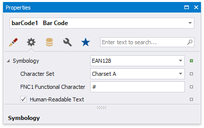
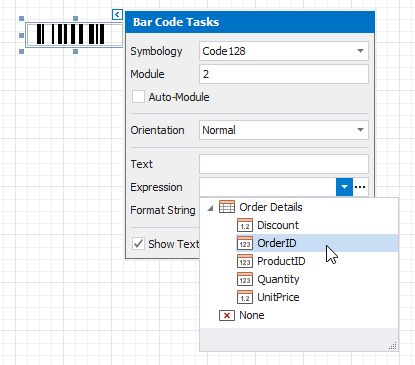
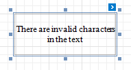

# Add Bar Codes to a Report

## Overview

To insert a bar code into a report, drag the **Bar Code** item from the [Toolbox](../../report-designer-tools/toolbox.md) onto the report's area.

After creating the bar code, select the bar code type (symbology) in the **Bar Code Tools** [toolbar](../../report-designer-tools/toolbar.md) tab's **Symbology** gallery.
	

	
After specifying the symbology, you can customize the type-specific options of the bar code, which are listed in the [Property Grid](../../report-designer-tools/ui-panels/property-grid.md) under the **Symbology** property.
	

## Main Options

You can use the **Binary Data** property to supply the data that a bar code should encode.

To specify the bar width (a bar code's resolution), use the following options:
	
* Automatically calculate the bar width according to a bar code's dimensions by enabling the **Auto Module** option;
* Provide a fixed bar width value using the **Module** property.

The following are some additional bar code options:
	
* Use the bar code's **Text** property to provide accompanying text. The **Show Text** property allows you to show or hide this text.

* Use the **Orientation** property to rotate a bar code.

* Use the **Padding** property to specify the indent between bars and the bar code's inner boundaries.

## Bind to Data

You can [bind](../../bind-to-data/bind-controls-to-data-expression-bindings.md) the bar code's **Text** property to a data field obtained from a report's data source. Click the control's smart tag, expand the **Expression** drop-down list and select the data field.

You can also click the **Expression** option's ellipsis button to invoke the **Expression Editor**. This editor allows you to construct a complex binding expression with two or more data fields.

## Common Errors
The following section explains how to work around the most frequently encountered errors related to the incorrect use of bar codes.

* The following error message is shown in place of the bar code if the control's dimensions are too small to fit the bar code with its specified resolution.
	
	
	
	To get rid of this error, enable the **Auto Module** property and/or increase the bar code's dimensions.

* The following error message appears when the data supplied to a bar code contains characters that are not supported by this bar code type.
	
	
	
	To avoid this error, supply data that applies to a particular bar code specification.
