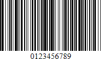

# Codabar

The **Codabar** is a discrete, self-checking symbology that may encode **16** different characters, plus an additional **4** start/stop characters. This symbology is used by U.S. blood banks, photo labs, and on FedEx air bills.

The following properties are specific to the **Codabar** type and listed in the [Property Grid](../../report-designer-tools/ui-panels/property-grid) under the **Symbology** property:

* **Start and Stop Symbols**
	
	Specifies the first (start) and last (stop) symbols used to code the bar code's structure.

* **Wide Narrow Ratio**

    Specifies the density of a bar code's bars.