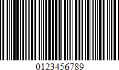

# Code 11 (USD-8)

**Code 11**, also known as **USD-8**, was developed as a high-density numerical-only symbology. It is used primarily in labeling telecommunications equipment.

The symbology is discrete and is able to encode the numbers **0** through to **9**, the dash symbol (**&#0045;**), and start/stop characters.

The are no properties specific to the **Code 11** bar code type.