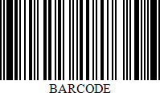

# Code 93

**Code 93** was designed to supplement and improve upon **Code 39**.

**Code 93** is similar in that, like **Code 39**, can represent the full ASCII character set by using combinations of **2** characters. It differs in that **Code 93** is a continuous symbology and produces denser code. It also encodes **47** characters (compared to **Code 39**'s **43** characters).

The following property is specific to the **Code 93** type and available in the [Property Grid](../../report-designer-tools/ui-panels/property-grid) under the **Symbology** property:

* **Calculate a Checksum**

    Specifies whether to calculate a checksum for the bar code.

    > [!NOTE]
	> A checksum of a **Code 93** bar code can contain characters that are not supported by this bar code symbology. For this reason, the checksum is not included in the **Code 93** bar code's displayed text.