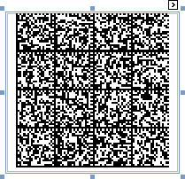

# ECC200 - Data Matrix

**Data Matrix** code (**ISO/IEC 16022** international standard) is a two-dimensional matrix bar code consisting of black and white "cells" arranged in a rectangular pattern. The information to be encoded can be text or raw data.

Every **Data Matrix** is composed of two solid adjacent borders in an "L" shape (called the "finder pattern"), and two other borders consisting of alternating dark and light cells or modules (called the "timing pattern"). Within these borders are rows and columns of cells that encode information. The finder pattern is used to locate and orient the symbol, while the timing pattern provides a count of the number of rows and columns in the symbol.

The following properties are specific to the **ECC200 - Data Matrix** type and available in the [Property Grid](../../report-designer-tools/ui-panels/property-grid) under the **Symbology** property:

* **Compaction Mode**
	
	Specifies whether textual information or a byte array should be used as the bar code's data, as well as its encoding.

* **Matrix Size**
	
	Specifies the bar code matrix size.