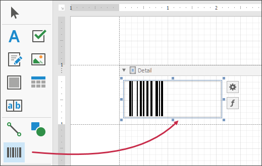
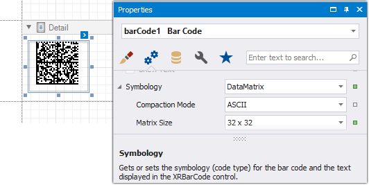

# ECC200 - Data Matrix

**Data Matrix** code (**ISO/IEC 16022** international standard) is a two-dimensional matrix barcode consisting of black and white "cells" arranged in a rectangular pattern. The information to be encoded can be text or raw data.

Every **Data Matrix** is composed of two solid adjacent borders in an "L" shape (called the "finder pattern"), and two other borders consisting of alternating dark and light cells or modules (called the "timing pattern"). Within these borders are rows and columns of cells that encode information. The finder pattern is used to locate and orient the symbol, while the timing pattern provides a count of the number of rows and columns in the symbol.

## Add the Barcode to a Report

1. Drag the **Barcode** item from the report controls toolbox tab and drop it onto the report. 

    

2. Set the control’s **Symbology** property to **DataMatrix**. 

    

3. Specify [common](add-bar-codes-to-a-report.md) barcode properties and properties [specific](#specific-properties) to **Data Matrix**.

## Specific Properties

In the [property grid](../../report-designer-tools/ui-panels/property-grid-tabbed-view.md), expand the **Symbology** list and specify the following properties specific to **Data Matrix**:

* **Compaction Mode**
	
	Specifies whether textual information or a byte array should be used as the barcode's data, as well as its encoding.

* **Matrix Size**
	
	Specifies the barcode matrix size.