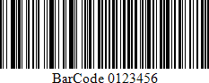

# GS1-128 - EAN-128 (UCC)

**GS1-128** (**EAN-128**) was developed to provide a worldwide format and standard for exchanging common data between companies.

While other bar codes simply encode data with no respect for what the data represents, **GS1-128** encodes data and encodes what that data represents.

The following properties are specific to the **GS1-128** (**EAN-128**) type and available in the [Property Grid](../../report-designer-tools/ui-panels/property-grid) under the **Symbology** property:

* **Character Set**
	
	Specifies the set of symbols which can be used when setting the bar code's text.

* **FNC1 Functional Character**
	
	Specifies the symbol (or set of symbols) in the bar code text that will be replaced with the **FNC1** functional character when the bar code's bars are drawn.

* **Human-Readable Text**

    Specifies whether or not parentheses should be included in the bar code's text to improve the readability of the bar code's text.