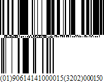

# GS1 - DataBar

The **GS1 DataBar** bar code is based on a family of symbols often used in the **GS1 DataBar Coupon** (coupon codes commonly used in retail).

These bar codes can encode up to **14** digits, which makes them suitable for **GTIN 8**, **12**, **13** and **14**.

**GS1 DataBar Expanded** and **GS1 DataBar Expanded Stacked** can encode up to **74** numeric or **41** alphanumeric characters, and provide the capability to utilize all **GS1 Application Identifiers** (e.g., expiration date, batch and serial number). These bar codes are often used in manufacturer coupons.

The following properties are specific to the **GS1 DataBar** type and available in the [Property Grid](../../report-designer-tools/ui-panels/property-grid) under the **Symbology** property:

* **FNC1 Functional Character**
	
	Specifies the symbol (or set of symbols) in the bar code text that will be replaced with the **FNC1** functional character when the bar code's bars are drawn.

* **Segments In Row**
	
	Specifies the number of data segments per row in the Expanded Stacked type of a GS1 DataBar bar code.

* **Type**
	
	Specifies the type of a GS1 DataBar bar code.
