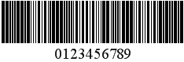

# Industrial 2 of 5

**Standard 2 of 5** is a low-density numerical bar code that is used in the photofinishing and warehouse sorting industries, as well as to sequentially number airline tickets.

The following properties are specific to the **Industrial 2 of 5** type and available in the [Property Grid](../../report-designer-tools/ui-panels/property-grid) under the **Symbology** property:

* **Calculate a Checksum**

    Specifies whether to calculate a checksum for the bar code.

* **Wide Narrow Ratio**

    Specifies the density of a bar code's bars.