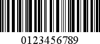

# Interleaved 2 of 5

**Interleaved 2 of 5** is a higher-density numerical bar code based upon the **Standard 2 of 5** symbology. It is used primarily in the distribution and warehouse industry.

The following properties are specific to the **Interleaved 2 of 5** type and available in the [Property Grid](../../report-designer-tools/ui-panels/property-grid) under the **Symbology** property:

* **Calculate a Checksum**

    Specifies whether to calculate a checksum for the bar code.

* **Wide Narrow Ratio**

    Specifies the density of a bar code's bars.