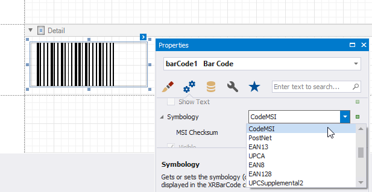

# MSI - Plessey

**MSI** was developed by the MSI Data Corporation, based on the original **Plessey Code**. **MSI**, also known as **Modified Plessey**, is used primarily to mark retail shelves for inventory control.

**MSI** is a continuous, non-self-checking symbology. While an **MSI** barcode can be of any length, a given application usually implements a fixed-length code.

## Add the Barcode to a Report

1. Drag the **Barcode** item from the report controls toolbox tab and drop it onto the report. 

    

2. Set the control’s **Symbology** property to **CodeMSI**. 

    

3. Specify [common](add-bar-codes-to-a-report.md) barcode properties and properties [specific](#specific-properties) to **MSI**.

## Specific Properties

In the [property grid](../../report-designer-tools/ui-panels/property-grid-tabbed-view.md), expand the **Symbology** list and specify the following property specific to **MSI**:

* **MSI Checksum**

    Specifies the barcode's checksum type, which defines the appearance of checksum bars added to the barcode.