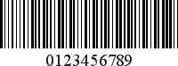

# MSI - Plessey

**MSI** was developed by the MSI Data Corporation, based on the original **Plessey Code**. **MSI**, also known as **Modified Plessey**, is used primarily to mark retail shelves for inventory control.

**MSI** is a continuous, non-self-checking symbology. While an **MSI** bar code can be of any length, a given application usually implements a fixed-length code.

The following property is specific to the **MSI** type and available in the [Property Grid](../../report-designer-tools/ui-panels/property-grid) under the **Symbology** property:

* **MSI Checksum**

    Specifies the bar code's checksum type, which defines the appearance of checksum bars added to the bar code.