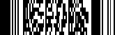

# PDF417

**PDF417** (**Portable Data File**) is a stacked linear two-dimensional bar code used in a variety of applications; primarily transport, postal, identification card and inventory management. It has spawned an Open Source decoder project together with an Open Source encoder.

The **PDF417** bar code is also called a **symbol** bar code and usually consists of **3** to **90** rows, each of which is like a small linear bar code.

The following properties are specific to the **PDF417** type and available in the [Property Grid](../../report-designer-tools/ui-panels/property-grid) under the **Symbology** property:

* **Columns**

    Specifies the number of bar code columns, which allows you to control the logic width of the bar code.

* **Compaction Mode**

    Specifies whether textual information or a byte array should be used as the bar code's data.

* **Error Correction Level**

    Specifies the amount of redundancy built into the bar code's coding, to compensate for calculation errors.

* **Rows**

    Specifies the number of bar code rows, which allows you to control the logic height of the bar code.

* **Truncate Symbol**

    Specifies whether the special end-symbol should be appended to the bar code.

* **Y to X Ratio**

    Specifies the height-to-width ratio of a logical unit's graphic representation.