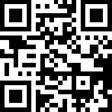

# QR Code

A **QR Code** (**QR** is the abbreviation for **Quick Response**) is a two-dimensional code, readable by **QR** scanners, mobile phones with a camera, and smartphones. **QR Code** can encode textual, numeric and binary data.

The following properties are specific to the **QR** type and available in the [Property Grid](../../report-designer-tools/ui-panels/property-grid) under the **Symbology** property:

* **Compaction Mode**

    Specifies whether numeric, alpha-numeric or byte information should be used as the bar code's data.
	
* **Error Correction Level**

    Specifies the amount of redundancy built into the bar code's coding, to compensate for calculation errors.

* **Version**

    Specifies the bar code's size.
	
