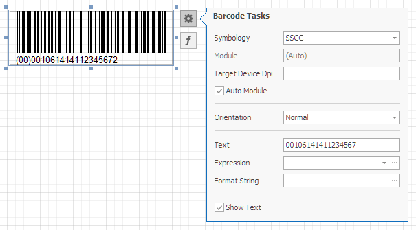

# Serial Shipping Container Code (SSCC)

The **Serial Shipping Container Code** (SSCC) is the GS1 Identification Key used to identify a logistic unit.
This unique identifier is composed of an Extension Digit, a GS1 Company Prefix, a Serial Reference, and a Check Digit.

## Add the Barcode to a Report

1. Drag the **Barcode** item from the report controls toolbox tab and drop it onto the report. 

    

2. Set the control’s **Symbology** property to **SSCC**. 

    

3. Specify [common](add-bar-codes-to-a-report.md) barcode properties.