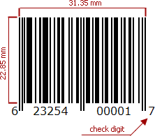

# UPC-A

The **UPC-A** bar code is by far the most common and well-known symbology, especially in the United States. A **UPC-A** bar code is the bar code you will find on virtually every consumer item on the shelves of your local supermarket, as well as books, magazines, and newspapers. It is called simply, a "UPC bar code" or "UPC Symbol."

The **UPC-A** bar code contains **12** digits, no letters or other characters. The first digit is the prefix signifying the product type. The last digit is the "check digit". The check digit is calculated using first eleven figures when the bar code is constructed. So, for the correct **UPC-A** you should specify only the first **11** digits.

The recommended dimensions are shown in the picture. The standard allows magnification up to **200**%, and reduction of up to **80**% of the recommended size.

There should be two quiet zones before and after the bar code. They provide reliable operation of the bar code scanner. The quiet zone recommended length is **2.97** mm for the bar code of standard width and height.
