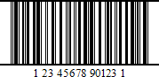

# UPC Shipping Container Symbol (ITF-14)

The **UPC Shipping Container Symbol** (**ITF-14**) bar code is used to mark packaging materials that contain products labeled with a **UPC** or **EAN** product identification number.

This bar code provides a **GS1** implementation of an **Interleaved 2 of 5** bar code for encoding a **Global Trade Item Number** (an identifier for trade items developed by **GS1**). This bar code always uses a total of **14** digits.

The thick black border around the symbol (the **Bearer Bar**) is intended to improve bar code reading reliability.

The following properties are specific to the **ITF-14** type and listed in the [Property Grid](../../report-designer-tools/ui-panels/property-grid) under the **Symbology** property:

* **Calculate a Checksum**

    Specifies whether to calculate a checksum for the bar code.

* **Wide Narrow Ratio**

    Specifies the density of a bar code's bars.