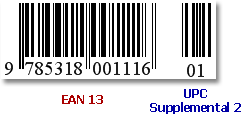

# UPC Supplemental 2

**2**-digit supplemental bar codes should only be used with magazines, newspapers and other periodicals.

The **2**-digit supplement represents the issue number of the magazine. This is useful so that the product code itself (contained in the main bar code) is constant for the magazine, so that each issue of the magazine doesn't have to have its own unique bar code. Nevertheless, the **2**-digit supplement can be used to track which issue of the magazine is being sold, for example, for sales analysis or restocking purposes.

The are no properties specific to the **UPC Supplemental 2** bar code type.