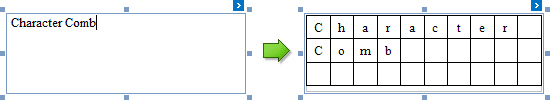
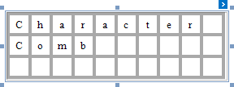
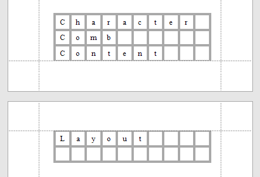
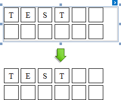
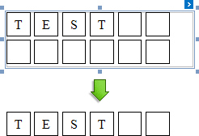

# Character Comb

## Overview
The **Character Comb** control displays text so that each character is printed in an individual cell.

To add a Character Comb to the report, drag the **Character Comb** item from the [Toolbox](../../report-designer-tools/toolbox.md) onto the report's area.

The number of cells displayed by the control in Print Preview depends on the **Can Shrink** and **Auto Width** settings.

* If both these properties are enabled, the number of cells corresponds to the number of characters in the control's text.
* Otherwise, the number of cells corresponds to the specified cell size and the control size.

See the [Content Layout and Position](#behavior) section to learn more on using these properties.

You can also adjust the character comb's size to match its characters using the **Fit Bounds To Text** [toolbar](../../report-designer-tools/toolbar.md) button or context menu command:

* If the **Word Wrap** option is enabled, the command keeps control content displayed in multiple lines. It decreases the control's height and adjusts the width to fit this content.
	
	

* If the **Word Wrap** option is disabled, the command adjusts the control's height and width to completely display the control's content in a single line. As a result, the number of cells corresponds to the number of characters.
	
	

When exporting this control to [third-party formats](../../../../print-preview/print-preview-for-winforms/exporting/exporting-from-print-preview.md), consider the following
* When a report is exported to an [XLS](../../../../print-preview/print-preview-for-winforms/exporting/xls-specific-export-options.md) or [XLSX](../../../../print-preview/print-preview-for-winforms/exporting/xlsx-specific-export-options.md) file, the cells of the Character Comb correspond to the cells of a resulting Excel sheet.
* When a report is exported to a [CSV](../../../../print-preview/print-preview-for-winforms/exporting/csv-specific-export-options.md) (or [TXT](../../../../print-preview/print-preview-for-winforms/exporting/txt-specific-export-options.md)) file, the content of individual cells is separated (or spaced) by a specified **Separator** character.

In most aspects, the Character Comb is similar to the [Label](Label.md) control from which it inherits most of its properties and its basic behavior. For general information about binding these controls to data and display summary function results, see the [Label](Label.md) topic. To learn about Character Comb specifics, see the following sections in this document.

## Main Options
The following properties are specific to the Character Comb control:

* **Cell Vertical Spacing** and **Cell Horizontal Spacing**
	
	Specify the spacing between adjacent cells (measured in [report units](../../configure-design-settings/change-a-report-measurement-units.md)). These values do not depend on the specified border width of a control.
	
	The following image illustrates a Character Comb with **Cell Vertical Spacing** set to **15** and **Cell Horizontal Spacing** set to **5**.
	
	
	
	The area between cells is painted using the background color of the control's parent container (the control's **Back Color** property is ignored for this area). In the following image, the control is assigned a gray background color, and the report's background color is white.
	
	
	

* **Border Width**
	
	Specifies the width of cell borders in pixels, as a floating point value.
	
	When the cell spacing is set to zero, the borders of adjacent cells are merged (i.e., the actual border width is not doubled).
	
	The following images illustrate how cell spacing affects the **Border Width** property behavior:
	
	| Cell Spacing = 0 | Cell Spacing = 1 |
	|---|---|
	|  |  |
	
	When the control's content is to be printed on multiple pages, a page break horizontally splits the cell border based on the cell spacing setting, as shown below.
	
	| Cell Spacing = 0 | Cell Spacing > 0 |
	|---|---|
	||  |

* **Cell Size Mode**
	
	Specifies whether or not the cell size should depend on the current font size of a control. The following cell size modes are supported:
	
	* **Custom**
		
		The cell size is determined by the **Cell Height** and **Cell Width** property values and does not depend on the assigned font size.
		
		With this setting, the actual cell size is less than the specified **Cell Height** and **CellWidth** by the **Border Width** value.

	* **Auto Size**
		
		The cell size depends on the current font size of a control (the **Cell Height** and **Cell Width** properties are ignored).
		
		With this setting, the actual cell size does not depend on the specified border width of a control.

	* **Auto Height**
		
		Only the cell height depends on the current font size of a control (the **Cell Height** property is ignored), and the **Cell Width** value is specified manually.
		
		With this setting, the following behavior is expected:
		
		* The actual cell height does not depend on the specified border width of a control.
		* The actual cell width is the difference between the specified **Cell Width** and **Border Width** values.

	* **Auto Width**
		
		Only the cell width depends on the current font size of a control (the **Сell Width** property is ignored), and **Cell Height** value is specified manually.
		
		With this setting, the following behavior is expected:
		
		* The actual cell width does not depend on the specified border width of a control.
		* The actual cell height is the difference between the specified **Cell Height** and **Border Width** values.

## Content Layout and Position
This section describes the **Character Comb** properties that affect the control's position on a page and content layout.

The following image illustrates the behavior of the **Auto Width** property that specifies whether or not the width of a control depends on its text.

| AutoWidth = true | AutoWidth = false |
|---|---|
|  |  |

The following image illustrates the behavior of the **Can Shrink** property that specifies whether or not the height of a control depends on its text.

| CanShrink = true | CanShrink = false |
|---|---|
|  | |

The **Text Alignment** property specifies the alignment of text within a control.

| TextAlignment = Top Left | TextAlignment = Middle Center | TextAlignment = Bottom Right |
|---|---|---|
|  | |  |