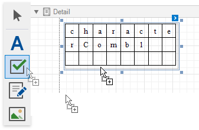
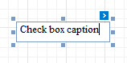
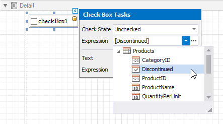
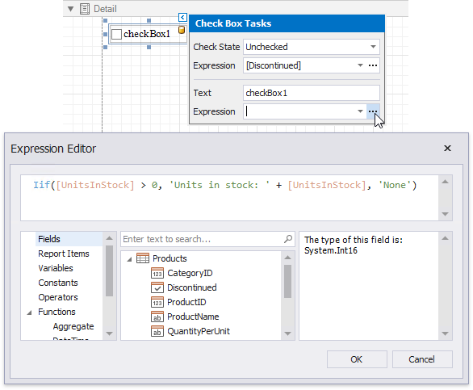
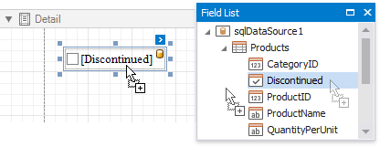
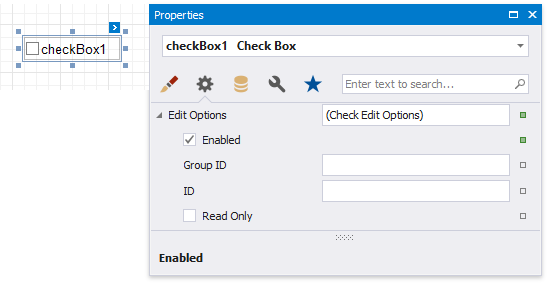
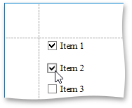

# Check Box

## Check Box Overview
The **Check Box** control displays **Yes**/**No** or **Checked**/**Unchecked**/**Indeterminate** values in a report.

You can add this control by dragging the **Check Box** item from the [Toolbox](../../report-designer-tools/toolbox.md) onto the report's area.

Use one of the following properties to set the check box's state:

* **Checked** - indicates whether the check box is selected (displays a check mark) or not (is empty).
* **Check State** - specifies one of the following check box states:	

    | Icon | Check State |
    |---|---|
    |  | Unchecked |
     | Checked|
    | |Indeterminate

The **Text** property specifies the check box's caption. You can double-click the check box to invoke its in-place editor and type the desired text.

Use the **Glyph Alignment** and **Text Alignment** properties to define the glyph and text alignment within the check box.

## Bind to Data
You can [bind](../../bind-to-data/bind-controls-to-data-expression-bindings.md) the **Check State** property to a data field obtained from a report's data source. Click the control's smart tag, expand the **Expression** drop-down list for the **Check State** property and select the required data field.

The data field value determines the check box state in the following manner:

* **True** or **1** activates the **Checked** state;
* **False** or **0** activates the **Unchecked** state;
* Any other value activates the **Indeterminate** state.

In the same way, expand the **Expression** drop-down list for the **Text** property and bind it to the desired data field.

Clicking the **Expression** option's ellipsis button invokes the **Expression Editor**, in which you can construct a complex binding expression involving two or more data fields.

You can also drag and drop a Boolean type data field from the [Field List](../../report-designer-tools/ui-panels/field-list.md) to create a new check box bound to this field.

See the [Bind Report Controls to Data](../../bind-to-data/bind-controls-to-data-expression-bindings.md) topic to learn more about creating data-aware controls.

## Interactivity
You can enable [changing the check box state](../../provide-interactivity/edit-content-in-print-preview.md) in Print Preview by setting the **Enabled** option in the **Edit Options** category to **Yes**.

The **Group ID** setting defines the check box's behavior in Print Preview:

* When you set this property to an empty string value, a check box can be switched to either the "checked" and "unchecked" state independently on other available check boxes.
	
	

* Otherwise, the field editor behaves like a radio button, and editors that have the same ID belong to a single logical group (that is, only one option can be selected in a group at a time).