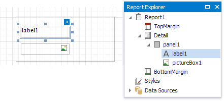

# Panel

The **Panel** control is a container that frames separate report controls and allows you to move, copy and paste them. The panel also visually unites report controls in Print Preview (for instance, with borders or a uniform color background).

To add a panel to a report, drag the **Panel** item from the [Toolbox](../../report-designer-tools/toolbox.md) and drop it onto the required report band.

Drop the desired report controls onto the panel to combine them to a group.

You can use this panel to move, copy, change appearance settings, etc. instead of adjusting individual controls.

The [Report Explorer](../../report-designer-tools/ui-panels/report-explorer.md) displays controls placed onto a panel as its subordinate nodes.

The panel cannot contain the following report controls:
* [Pivot Grid](../use-charts-and-pivot-grids.md)
* [Subreport](../use-basic-report-controls/subreport.md)
* [Page Break](../use-basic-report-controls/page-break.md)
* [Table of Contents](../use-basic-report-controls/table-of-contents.md)
* [Cross-Band Line and Box](../draw-lines-and-shapes/draw-cross-band-lines-and-boxes.md)

If a panel includes only one control, you can use the **Fit Bounds to Container** command in the context menu or in the **Layout** toolbar tab. This command resizes the control so that it occupies all the available container space (excluding borders).

You can also enable the panel's **Can Shrink** property to automatically adjusts the panel's size to fit all the inner controls. For instance, this allows preventing blank areas when you [conditionally hide specific controls](../../shape-report-data/shape-data-expression-bindings/conditionally-supress-controls.md).

> [!NOTE]
> The Panel control cannot span several [report bands](../../introduction-to-banded-reports.md) as [cross-band controls](../draw-lines-and-shapes/draw-cross-band-lines-and-boxes.md) can.