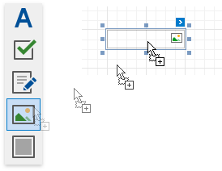
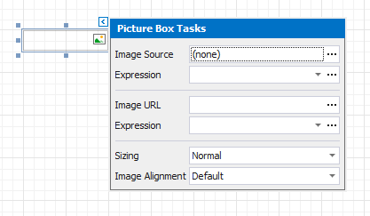
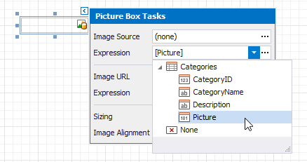
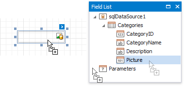
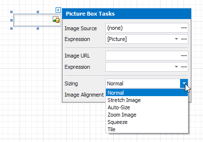

# Picture Box

## Overview
The **Picture Box** control allows you to embed _static_ (stored with the report) or _dynamic_ (obtained from a data source) images into a report.

To add this control to a report, drag the **Picture Box** item from the [Toolbox](../../report-designer-tools/toolbox.md) onto the report's area.

The Picture Box can display images with the following formats: BMP, JPG, JPEG, GIF, TIF, TIFF, PNG, ICO, DIB, RLE, JPE, JFIF, EMF, WMF.

Use the **Image** or **Image URL** property to specify the image the Picture Box displays. You can access these properties in the control's smart tag.

The specified image is [saved](../../save-reports.md) with the report if you use the **Image** property. If you use the **Image URL** property, only the path to the image is stored. 

## Bind to Data
You can use the Picture Box to display an image [dynamically obtained](../../bind-to-data/bind-controls-to-data-expression-bindings.md) from a data source. Click the control's smart tag, expand the **Image** property's **Expression** drop-down list and select the data field.

You can bind the **Image URL** property to data in the same way. 

Click the **Expression** option's ellipsis button to invoke the **Expression Editor**. This editor allows you to construct a complex binding expression with two or more data fields.

You can also drag and drop a field that contains image data from the [Field List](../../report-designer-tools/ui-panels/field-list.md) to create a new Picture Box bound to this field.

See the [Bind Report Controls to Data](../../bind-to-data/bind-controls-to-data-expression-bindings.md) topic for more information about how to create data-aware controls.

## Image Size Modes

Use the **Sizing** property to specify an image's position in the Picture Box. 

This control supports the following image size modes:

* **Normal**
    
    The image is displayed at the top left corner with its original dimensions. The image is clipped if it does not fit the control's boundaries. 

    

* **Stretch Image**

    The image is stretched or shrunk to fill the control's width and height.

    

* **Auto Size**

    The control's dimensions are adjusted to the image's size.

    

* **Zoom Image**

    The image is resized proportionally without clipping it to fit the control dimensions.

    

* **Squeeze**

    The image is centered and shown full-size if the control dimensions exceed the image size. Otherwise, the image is resized to fit the control's boundaries.

    

* **Tile**

    The original image is replicated within the control starting from the top left corner. The replicated image is clipped if it does not fit the control's boundaries.

    

You can also use the **Image Alignment** property in the **Normal**, **Squeeze** and **Zoom Image** modes to specify the alignment in relation to the control's boundaries.
