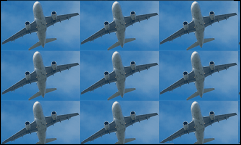

# Picture Box

## Overview

Use the **Picture Box** control to add images to a report. The images can have one of the following formats: BMP, JPG, JPEG, GIF, TIF, TIFF, PNG, ICO, DIB, RLE, JPE, JFIF, EMF, WMF, SVG.

To add the **Picture Box** control to a report, drag the **Picture Box** item from the [Toolbox](../../report-designer-tools/toolbox.md) onto the report's area.

Specify one of the following properties to set an image:

- **Image Source**  
    Save the image to the report definition.
- **Image Url**  
    Only save a path to the image.

## Assign an External Image

Click the **Image Source** / **Image URL** property's ellipsis button to invoke the **Open File** dialog.

The selected image or its URL is saved to the report definition **.repx** file.

## Assign an Image from the Report's Image Collection

Set the report's **Image Resources** property.

Click the **Picture Box**'s smart tag. In the invoked menu, click the **Expression** option's ellipsis button to open the **Expression Editor**. Choose an image from the **Images** collection:

## Bind a Picture Box to Data

Use one of the following techniques to add the **Picture Box** control that obtains an image from a data source.

- Click the control's smart tag. In the invoked menu, expand the **Expression** drop-down list for the **Image Source** property and select a data field.

    

    You can bind the **Image Url** property to data in a similar way. In this instance, the URL that specifies the image location is obtained from the data source.  

    Click the **Expression** option's ellipsis button to invoke the **Expression Editor**. Use this editor to construct a [binding expression](../../use-expressions.md) that can include two or more data fields.

- Drag an image data field from the report's [Field List](../../report-designer-tools/ui-panels/field-list.md) and drop it onto a report band.

    

- Right-click a data field in the [Field List](../../report-designer-tools/ui-panels/field-list.md) and drop it onto a report band. Select the **Picture Box** item in the invoked context menu.

    

See the [Bind Report Controls to Data](../bind-controls-to-data.md) topic for more information about how to create data-aware controls.

## SVG Support Limitations

The **Picture Box** control does not support the following SVG content:

- Gradient colors
- Text (you can convert text to curves as a workaround)
- Animations
- External .css styles

Export (except for PDF) has the following limitations:

- SVG images are converted to metafiles because document viewers may not support SVG format.
    
- SVG images are exported as PNG in the Microsoft Azure environment.

The **Medium Trust** permission level does not support SVG.

## Image Size Modes

Use the **Sizing** property to specify an image's position in the Picture Box. 

This control supports the following image size modes:

* **Normal**
    
    The image is displayed at the top left corner with its original dimensions. The image is clipped if it does not fit the control's boundaries. 

    

* **Stretch Image**

    The image is stretched or shrunk to fill the control's width and height.

    

* **Auto Size**

    The control's dimensions are adjusted to the image's size.

    

* **Zoom Image**

    The image is resized proportionally without clipping it to fit the control dimensions.

    

* **Squeeze**

    The image is centered and shown full-size if the control dimensions exceed the image size. Otherwise, the image is resized to fit the control's boundaries.

    

* **Tile**

    The original image is replicated within the control starting from the top left corner. The replicated image is clipped if it does not fit the control's boundaries.

    

You can also use the **Image Alignment** property in the **Normal**, **Squeeze** and **Zoom Image** modes to specify the alignment in relation to the control's boundaries.

## Interactivity

You can add a possibility to load/change an image and/or draw a signature in a picture box when it is displayed in Print Preview. To do this, enable the **Edit Options** | **Enabled** property.

Click the picture box in a previewed document and an editor invokes.

> [!Tip]
> You can draw borders for the picture box to make the editor visible in Print Preview, if an image is not specified.

Refer to the [Content Editing in Print Preview](../../provide-interactivity/edit-content-in-print-preview.md) topic for details and to the [Interactive E-Forms](../../create-reports/interactive-e-forms.md) tutorial to see how the E-Form demo report uses this picture box mode.
