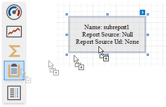

# Subreport

The **Subreport** control is used to embed other reports into the current report.

To add this control to the report, drag the **Subreport** item from the [Toolbox](../../report-designer-tools/toolbox.md) onto the report's area.

The Subreport control allows you to solve the following tasks:

* **Reuse reports**
	
	This can be useful if there is a particular report structure (template) that needs to be included in many reports, and the report must have consistent appearance and functionality. A good example is a report header that always contains the same information (the company information, logo, date, etc.).

* **Create master-detail reports**
	
	Another reason for using subreports is to create master-detail reports (reports with hierarchically linked data). For more details on this, see [Create a Master-Detail Report (Use Subreports)](../../create-popular-reports/create-a-master-detail-report-use-subreports.md).

Use one of the following properties to provide the report source:

* **Report Source**

    Determines a report to be included as a subreport.

    If report classes of the application that invoked the Report Designer are compiled into one assembly, then they are available as items in this combo box.

* **Report Source URL**

    Defines an URL of a report file (*.REPX), to be used as a report source.

Double-clicking a subreport opens its associated report in a new Report Designer tab.