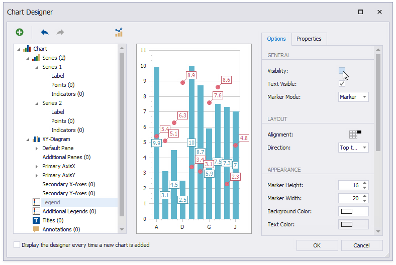
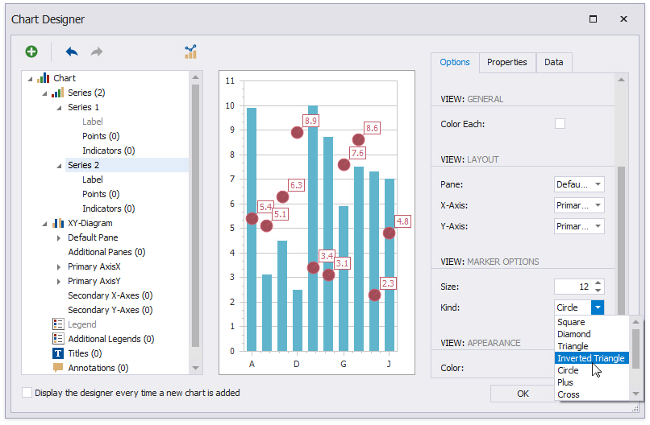

# Add a Chart (Set Up Series Manually)

This document describes how to add a chart to a report, provide data for chart series, and set up chart elements. This example shows two chart series based on the same data source. You can use different data sources for different series.

## Add a Chart to a Report

1. Drop the **Chart** control from the [Toolbox](../../report-designer-tools/toolbox.md) onto the [Detail band](../../introduction-to-banded-reports.md).

    

    The **Chart Designer** wizard is invoked after you drop a chart. Disable the **Display the designer every time a new chart is added** option if you do not want to trigger the wizard.

    

    Close the wizard at this stage.

2. Click the chart's [smart tag](../../../../../articles/report-designer/report-designer-for-winforms/use-report-elements/manipulate-report-elements/select-report-elements-and-access-their-settings.md) to bind the chart to data. Expand the **Data Source** property's drop-down and click **Add Report Data Source**.

    

3. The invoked [Data Source Wizard](../../report-designer-tools/data-source-wizard.md) enables you to assign a data source to the chart. Bind the chart to a data source as described in the [Bind to Data](../../bind-to-data.md) section.

> [!NOTE]
> The report's **Data Source** property should be set to **None** because you placed the Chart in the Detail band. When a report has its **Data Source** property specified, the Chart is repeated in the preview as many times as there are records in the report's data source.

## Add Series to the Chart

1. Switch to the **Chart Tools** toolbar tab and click **Run Designer**.

    

2. Add a new series to the chart.

	* Locate **Series** in the chart elements tree and click the plus button.
	* Select the view type (for example, **Bar**) from the invoked list.

    

3. Populate the created series with points.

	- Switch to the created series' **Data** tab on the designer window's right.
	- Select a data source from the drop-down list.
	- Drop data fields onto the **Argument** and **Value** cells to define series' points.

    

    The **Properties** tab displays the **Argument Data Member** and **Value Data Members** settings that are assigned to dropped fields.

4. Filter series data.

    - Seitch to the **Properties** tab.
    - Click the **Filter String** property's ellipsis button.
    - Construct filter criteria in the invoked **FilterString Editor** and click **OK**.

    

5. Create another series with the same settings. Select the **Point** view type for this series.

## Customize the Chart

Apply the following adjustments to improve the chart's appearance:

* Remove the chart legend (the chart series are bound to the same data).

	- Select **Legend** in the chart elements tree.
	- Disable the **Visibility** check box in the **Options** tab.

    

* Select the **Label** node under **Series 1** and disable the **Visibility** check box to hide the series' point labels.
* Customize the **Series 2** markers' appearance. Set the **Size** to **12** and **Kind** property to **Inverted Triangle** to replace the default circle with an upside down triangle.

    

* Customize the chart's appearance settings. For instance, select **Nature Colors** in the **Palette**'s drop-down list.

    

## View the Result

Switch to [Print Preview](../../preview-print-and-export-reports.md) to see the resulting report.

