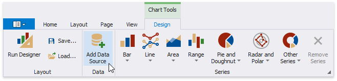
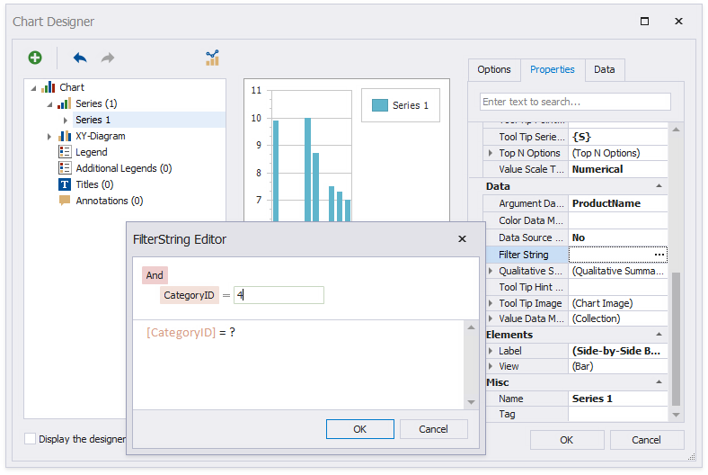

# Add a Chart (Set Up Series Manually)

This document describes how to add a chart to a report, provide data for the chart series, and set up a chart's elements. In this example, series data has a single data source. You can also use different data sources for different series.

## Add a Chart to a Report

1. Drop the **Chart** control from the [Toolbox](../../report-designer-tools/toolbox.md) onto the [Detail band](../../introduction-to-banded-reports.md).

    

    After you drop the chart, the **Chart Designer** is automatically invoked if its **Display the designer every time a new chart is added** option is enabled. Close the designer at this step.

2. Open the [Toolbar](../../report-designer-tools/toolbar.md)'s **Chart Tools** contextual tab and click **Add Data Source** to bind the chart to data. 

    

3. The invoked [Data Source Wizard](../../report-designer-tools/data-source-wizard.md) enables you to assign a data source to the chart. Bind the chart to a data source as described in the [Bind to Data](../../bind-to-data.md) section.

4. Click the chart's smart tag and make sure that the **Data Source** and **Data Member** properties were specified correctly.
	
	

> [!NOTE]
> The report's **Data Source** property should be set to **None** because you placed the Chart in the Detail band. When a report has its **Data Source** property specified, the Chart is repeated in the preview as many times as there are records in the report's data source.

## Add Series to the Chart

1. Switch to the **Chart Tools** toolbar tab and click **Run Designer**.

    

2. Do the following in the invoked **Chart Designer** to add a new series to the chart control:

	* Locate the **Series** element in the chart elements tree and click the plus button.
	* Select the type (for example, **Bar**) in the invoked series type list.

    

3. Perform the following steps to populate the created series with points:

	- Select the series in the tree and switch to the **Data** tab to the right of the designer's window.
	- Select an existing data source in the corresponding drop-down list.
	- Drag-and-drop the data fields onto the **Argument** and **Value** cells to define series points' coordinates.

    

    The **Properties** tab displays the **Argument Data Member** and **Value Data Members** settings that are automatically assigned to the corresponding fields.

4. Click the **Data Filters** property's ellipsis button to filter series data. You can create and adjust the filter criteria in the invoked dialog.

    

5. Create another series with the same settings. For instance, select the **Point** view type for this series.

6. You can do the following to see how the chart looks when it is populated with data:

    * save changes made in the Chart Designer;
    * close the Chart Designer;
    * switch to [Print Preview](../../preview-print-and-export-reports.md).

    Return to the Report Designer and invoke the Chart Designer. The chart axes are now populated with actual data, and you can customize the chart.

## Customize the Chart

Apply the following adjustments to improve the chart's appearance:

* Remove the chart's legend (the chart series are bound to the same data).

	- Select **Legend** in the chart elements tree.
	- Disable the **Visibility** check box in the **Options** tab.

* Select the **Label** node under this series and disable the **Visibility** check box to hide **Series1**'s point labels.
* Customize the **Series2** markers' appearance. Set the **View.Point Marker Options.Kind** property to **InvertedTriangle** and **View.Point Marker Options.Size** to **12** to replace the default circle with an upside down triangle.
* Customize the chart's appearance settings. For instance, select **Nature Colors** in the **Palette**'s drop-down list.

## View the Result

Switch to [Print Preview](../../preview-print-and-export-reports.md) to see the resulting report.

